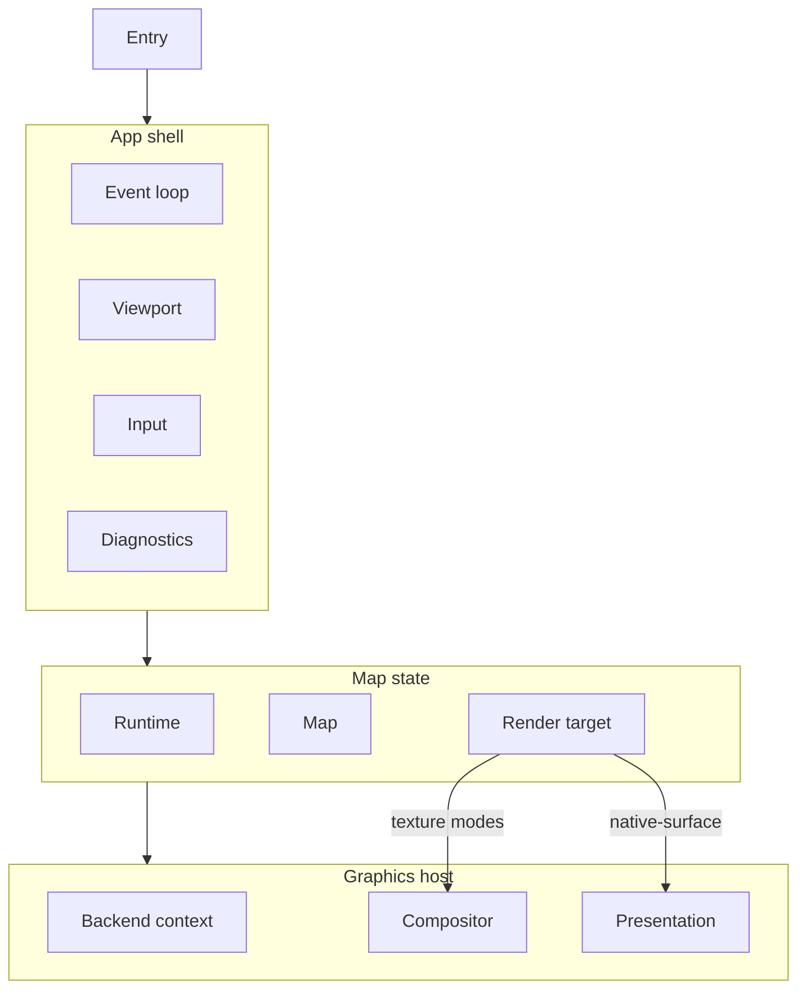
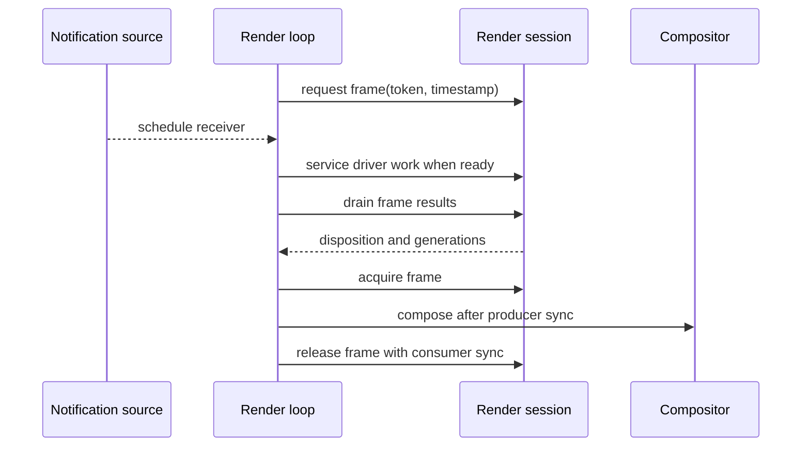

Specification for interactive `*-map` example programs: small apps that exercise
language bindings and render-target integrations through a focused map demo.

The specification has four sections:

1. [Mise tasks](#mise-tasks) — the build and run commands every example exposes.
2. [Shared baseline](#shared-baseline) — map, render-session, frame-loop, and
   graphics contracts common to every profile.
3. [Desktop profile](#desktop-profile) — windowed desktop hosts with CLI entry
   and keyboard/mouse input.
4. [Mobile profile](#mobile-profile) — embedded view hosts with touch input.

Implement a desktop example by reading Shared baseline and Desktop profile.
Implement a mobile example by reading Shared baseline and Mobile profile.

---

## Implementations

| Example                | Profile | Binding    | Toolkit         | Platforms             | Backends              |
| ---------------------- | ------- | ---------- | --------------- | --------------------- | --------------------- |
| `examples/c-map`       | Desktop | C          | SDL3            | Linux, macOS          | Vulkan, Metal, OpenGL |
| `examples/zig-map`     | Desktop | Zig        | SDL3            | Linux, macOS, Windows | Vulkan, Metal, OpenGL |
| `examples/go-map`      | Desktop | Go         | SDL3            | Linux                 | OpenGL                |
| `examples/rust-map`    | Desktop | Rust       | winit           | Linux, macOS, Windows | Vulkan, Metal, OpenGL |
| `examples/lwjgl-map`   | Desktop | Kotlin/JVM | GLFW, LWJGL     | Linux, macOS, Windows | Vulkan, Metal, OpenGL |
| `examples/android-map` | Mobile  | Kotlin     | Android view    | Android               | OpenGL/EGL            |
| `examples/dotnet-map`  | Desktop | C#         | GLFW            | Linux, macOS, Windows | Vulkan, Metal, OpenGL |
| `examples/swift-map`   | Desktop | Swift      | AppKit, SwiftUI | macOS                 | Metal                 |
| `examples/swift-map`   | Mobile  | Swift      | UIKit           | iOS                   | Metal                 |

The Compose map example follows the broad strokes of this specification, but
uses its own renderer-integration architecture for Skiko texture sharing.

For examples built by native render-backend variant, “Backends” is the union of
supported configured variants. Each native library artifact includes one render
backend. A single run uses one graphics API, selected at build time
(build-variant examples) or at startup from the loaded library (multi-context
examples).

---

## Mise tasks

Every example exposes the same task contract in its `mise.toml`:

- `build [preset]` compiles the example against a native install prefix. The
  preset defaults to `{{vars.host_native_preset}}`, and the task depends on
  `//:build` for that preset. Both come from the root `ffi:preset` task
  template.
- `run [render-target] [--preset <preset>]` builds and launches the example by
  extending the root `ffi:example-run` task template. The render target defaults
  to `owned-texture`, so `mise run //examples/zig-map:run` works with no
  arguments, and a mode name overrides it, as in
  `mise run //examples/zig-map:run borrowed-texture`.

An example that has not yet implemented every backend rejects an unsupported
preset with an error that names what it supports: `go-map` drives OpenGL
directly and accepts only `*-egl` presets.

The render-target argument is how a caller reaches the modes in
[Render-target selection](#render-target-selection); the program's own CLI
contract is unchanged.

---

## Shared baseline

### Scope

#### What every example provides

- All map, runtime, and render access from application code through the
  project’s language binding for that language.
- Continuous map mode: receiver-scoped notification draining and repaint driven
  by map render events and user input.
- Initial style URL and camera per [Shared defaults](#shared-defaults).
- Camera controls per the active profile ([Desktop profile → Input](#input) or
  [Mobile profile → Input](#input-1)).
- Every graphics API the host toolkit and target platform can support across
  configured variants (Vulkan, Metal, OpenGL/EGL as applicable).
- Render-target coverage per the active profile
  ([Render-target coverage](#render-target-coverage)).
- Startup logging that identifies the active render-target mode and which native
  render backends the loaded library supports.

#### What an example is not

A `*-map` program is a focused map demo. It MUST NOT include automated tests or
packaging/installer UX.

### Shared defaults

#### Style

- Style URL: `https://tiles.openfreemap.org/styles/bright`
- Load the style during map initialization, before the first render.

#### Initial camera

| Field   | Value                                                     |
| ------- | --------------------------------------------------------- |
| Center  | latitude `37.7749`, longitude `-122.4194` (San Francisco) |
| Zoom    | `13.0`                                                    |
| Bearing | `12.0` degrees                                            |
| Pitch   | `30.0` degrees                                            |

Apply with an immediate `jump_to` on startup.

#### Map and runtime

- Runtime cache path: `:memory:` (in-memory).
- Map mode: continuous (`MLN_MAP_MODE_CONTINUOUS`).

### Architecture

#### Overview

Every `*-map` example splits host responsibilities into the same logical
modules. Names differ by language; boundaries MUST NOT be collapsed into a
single monolithic type.



#### Logical modules

| Module           | Responsibility                                                                                                          |
| ---------------- | ----------------------------------------------------------------------------------------------------------------------- |
| App shell        | Profile entry, toolkit lifecycle, main event loop, shutdown ordering.                                                   |
| Viewport         | Map logical size, physical drawable size, and `scale_factor` for `RenderTargetExtent`.                                  |
| Map state        | Owns runtime, map, and active render target; loads style and initial camera.                                            |
| Graphics context | Creates/configures the host presentation surface and owns host graphics API context and presentation resources.         |
| Render target    | Owns the render session and mode-specific resources such as compositors, borrowed textures/images, and acquired frames. |
| Compositor       | Host pass that draws a map-owned or borrowed texture into the swapchain.                                                |
| Input            | Pointer and/or touch → map camera APIs; profile-specific control help.                                                  |
| Diagnostics      | Optional log callback and consistent error messages on failed setup or camera commands.                                 |

Implementations SHOULD mirror this layout in the source tree (separate files or
packages per module).

#### Threads and drivers

Examples have one host render loop and one native scheduler thread owned by the
runtime. The render target chooses one of the driver contracts described in
[Concepts](/maplibre-native-ffi/concepts/).

- The runtime owns its scheduler thread. Runtime creation starts it, runtime
  close joins it, and no host code pumps it.
- A core-worker session owns a native serial graphics worker.
- A caller-driver session stores typed native work until the render loop
  services it with the graphics context usable.
- Runtime, map, render-session control, operation, and notification calls may
  run on any host thread.
- The notification callback may run on any native thread. Examples MUST use it
  to schedule a later drain on the host graphics thread, because a ready batch
  can contain driver work that requires that thread. The C API also permits a
  callback to drain and service suitable endpoints inline.
- Driver service and thread-current accessors MUST run serially on the host
  graphics thread.

Desktop examples use caller drivers because their host WGL, shared EGL, Metal,
or Vulkan presentation context belongs to the render loop. Browser examples use
a caller driver for existing WebGL and WebGPU objects. A transferred
`OffscreenCanvas` WebGL target MAY use a core worker, which creates and uses its
WebGL2 context on that worker.

##### Render loop thread by host toolkit

Where the host toolkit fixes display-refresh and window callbacks, that thread
is the render loop thread. Where a graphics API context is thread-current, the
render loop thread is the only thread that makes it current.

| Example       | Render loop thread                                 |
| ------------- | -------------------------------------------------- |
| `c-map`       | process main thread (SDL window, graphics context) |
| `zig-map`     | process main thread (SDL window, graphics context) |
| `go-map`      | process main thread (SDL window, graphics context) |
| `rust-map`    | winit event-loop thread                            |
| `lwjgl-map`   | GLFW main thread                                   |
| `dotnet-map`  | GLFW main thread                                   |
| `swift-map`   | main run loop (`CADisplayLink`, AppKit/UIKit)      |
| `android-map` | UI thread (`Choreographer`)                        |
| `compose-map` | native surface bridge's producer thread            |

##### Attaching the render session

Startup waits for map creation, then starts target attachment with the selected
driver. Attach returns both an attaching session and an operation. A
caller-driver example MUST service ready work before awaiting that operation;
otherwise initialization deadlocks.

The common options use the render-loop receiver's notification source for
operation, frame-result, and driver-work readiness. A separate source MAY be
used when the host has separate receivers.

For a caller driver, attach descriptors are produced where the graphics context
is usable. Host-shared WGL and EGL contexts use the caller driver. A transferred
`OffscreenCanvas` descriptor instead names its canvas selector and creates its
WebGL2 context on a core worker.

Reattachment first completes normal detach through the selected driver and
destroys the CPU-only session handle. The example then rebuilds mode resources
and starts a new attachment. If the graphics owner cannot service detach, the
example MUST abandon the session before destroying it.

#### Graphics API and mode matrix

The example architecture MUST model the active graphics API, render-target mode,
and driver separately. Graphics context code owns API-level resources. Render
target code owns the session, attach and detach operations, frame demand and
result drains, driver service, mode resources, resize, and presentation.

The loaded native library reports one render backend per library artifact
through `mln_supported_render_backend_mask()`. Examples built across native
render-backend variants expose the union of those backends in the
[Implementations](#implementations) table.

Graphics API selection follows one of these patterns:

- **Build-variant examples** compile only the graphics API implementation that
  matches the active native build variant (for example `zig-map`, `rust-map`,
  `swift-map`).
- **Multi-context examples** ship a graphics context per targeted API and select
  the active API at startup from `supportedRenderBackends()` (for example
  `lwjgl-map`, `dotnet-map`).

OpenGL examples that can run with multiple context providers select EGL or WGL
from `supportedOpenGLContextProviders()`.

Each process run uses one graphics API. Render-target mode selection follows the
active profile ([Entry](#entry) or [Entry and shell](#entry-and-shell)).

Adding a graphics API or render-target mode MUST require localized changes. Keep
each graphics API and render-target mode in its own variant, class, or submodule
rather than branching ad hoc through shared draw code.

### Lifecycle

#### Startup

Order MUST be:

1. Parse profile entry configuration and validate the selected mode and driver.
2. Validate the loaded library's backend and target capabilities.
3. Create the host presentation surface and graphics resources.
4. Create the receiver-scoped notification source and install a scheduling
   callback.
5. Start and await runtime creation.
6. Start and await map creation with the initial extent.
7. Select the event types that the example reads.
8. Submit the style and initial camera commands.
9. Start render-target attachment and retain both returned handles.
10. For a caller driver, service ready work on the graphics thread until the
    attach operation completes.
11. Inspect and release the operation, then read negotiated capabilities.
12. Print the active mode and driver.

Failure cleanup follows the same detach or abandon path as normal shutdown.

#### Shutdown

On host termination or fatal error:

1. Stop new frame demand.
2. Release acquired frames and await their slot-release operations.
3. Start normal detach. Continue caller-driver service until it completes.
4. If graphics service is permanently unavailable, abandon instead and report
   any quarantined resources.
5. Destroy the detached or abandoned session from any thread.
6. Release compositor and target resources.
7. Start and await map close, then runtime close.
8. Release the notification source and graphics resources.

A map close preflight rejects an attaching or attached session without changing
map state.

#### Handle ownership

- One notification source per host receiver.
- One runtime per process, with one native scheduler thread.
- One map per runtime for the demo.
- One attaching or attached session per map.
- Frame-result batches own their records independently of the session.
- Every acquired-frame handle leases one texture-ring slot until its release
  operation completes.
- Graphics handles stay valid through normal detach. Abandon quarantines
  resources that cannot be destroyed without graphics access.

### Frame loop

The host display source submits frame demand. Map updates wake the selected
driver directly; runtime events are observations and are not a render-progress
mechanism.

#### Render loop iteration

1. Handle window, input, and resize events. Submit any-thread map and session
   work directly.
2. Drain ready notification batches.
3. Service caller-driver work on the graphics thread while its endpoint is
   ready, including when presentation is paused.
4. Drain frame-result batches until empty and release each batch.
5. For a rendered owned-texture result, acquire one frame, wait for producer
   synchronization, and submit the compositor pass.
6. Present and release an acquired frame with consumer-completion
   synchronization.



#### Cadence and results

- The render loop MUST submit demand from the host display or invalidation
  source while visible.
- Each demand MUST carry a unique host token and the display timestamp.
- A positive deadline MUST use the host's monotonic clock domain. Deadline
  missed is terminal and does not enter an immediate retry loop.
- Rendered, no update, size pending, target not ready, superseded, and deadline
  missed MUST remain distinct outcomes.
- No update and size pending wait for a newer map update. Target not ready waits
  for target readiness or a paced retry.
- Result readiness is level-triggered. The example MUST drain every result and
  MUST release the batch before starting another drain.
- The frame result's map-update, extent, and frame generations determine what
  was rendered. Runtime event order MUST NOT be used as a substitute.
- The example MAY keep presenting the previous completed texture when a newer
  frame misses its deadline.
- Resize, target replacement, queries, readback, barriers, maintenance, and
  detach progress through the same selected driver.

The example MUST continue servicing a caller-driver mailbox while display
callbacks are paused. If that becomes impossible, it abandons the session.

### Viewport

The viewport value MUST contain:

| Field                               | Meaning                                                                   |
| ----------------------------------- | ------------------------------------------------------------------------- |
| `logical_width`, `logical_height`   | Map coordinate extent passed to `MapOptions` / `RenderTargetExtent`.      |
| `physical_width`, `physical_height` | Drawable pixels of the host framebuffer.                                  |
| `scale_factor`                      | Ratio between physical and logical sizes (content scale / pixel density). |

Derivation rules:

- Read logical and physical sizes from the host toolkit after surface creation
  and on every resize or backing-scale change.
- Compute logical dimensions from physical size and scale when the toolkit only
  exposes physical pixels (use `ceil(physical / scale)`, minimum `1`).
- Log viewport changes at informational level with field labels
  `logical=… physical=… scale=…`.

Pass `logical_*` and `scale_factor` to map creation, session attach, and session
`resize`.

### Map state

The map state module owns the runtime, map, and render session handles plus
map-specific setup.

#### Creation

- Create and await the runtime operation with a `:memory:` cache.
- Create and await the map operation with the current viewport extent and
  continuous mode.
- Select every event type the example reads before it loads the style. A map
  queues an event only while its subscription selects that type.
- Submit the [style URL](#style) command.
- Submit the [initial camera](#initial-camera) command.
- Attach a render target by dispatching on active graphics API and selected
  mode.

#### Notification drain

- Drain the notification source when its callback schedules the receiver.
- Read every endpoint in each owned ready batch, then release the batch.
- Drain runtime events, frame results, and operation completions through their
  typed APIs while their endpoints remain ready.
- Schedule graphics-thread service when the driver-work endpoint is ready.

#### Resize API

Expose `resize(viewport)` for the active render target, resize API-level
resources when the graphics context requires it, and submit one map resize
command with the same logical extent. Map resize is the sole authority for
logical width, height, and scale factor after creation.

### Render-target modes

Shared baseline defines three render-target modes (discriminant/class, attach
paths, and present behavior). Each example implements only the modes required by
its profile ([Render-target coverage](#render-target-coverage)). Example
architecture MUST model each implemented mode.

#### Mode comparison

| Mode identifier    | C API concept                            | Compositor | Role                                                        |
| ------------------ | ---------------------------------------- | ---------- | ----------------------------------------------------------- |
| `owned-texture`    | Session-owned backend texture            | Required   | Map allocates texture, host samples it.                     |
| `borrowed-texture` | Caller-owned texture borrowed by session | Required   | Host allocates exportable texture; session renders into it. |
| `native-surface`   | Window presentation surface              | None       | Map renders directly to the host presentation target.       |

#### Startup status lines

Startup MUST print the active mode identifier and exactly one line from this
table:

| Mode identifier    | Printed line                                                                                       |
| ------------------ | -------------------------------------------------------------------------------------------------- |
| `owned-texture`    | `render target status: samples MapLibre-owned texture frames into the host swapchain`              |
| `borrowed-texture` | `render target status: renders into a host-owned texture, then samples it into the host swapchain` |
| `native-surface`   | `render target status: renders directly to the host window surface`                                |

#### `owned-texture`

- Request a ring depth of two or three for interactive composition.
- After a rendered result, acquire the oldest completed unacquired frame.
- Wait for producer completion before sampling.
- Release the handle with consumer-completion synchronization after submitting
  compositor GPU work. Await or observe the release operation.
- Keep presenting the previous completed frame when acquisition reports not
  ready.

#### `borrowed-texture`

- Create an exportable texture sized to the viewport.
- Attach with the borrowed-texture descriptor referencing host-owned handles.
- After a rendered result, sample that texture through the compositor path.
- On resize, allocate a replacement and start the backend target-replacement
  operation. Retain both allocations until its outcome is known.

#### `native-surface`

- Attach with the surface descriptor for host presentation.
- Set the present flag on frame demand.
- A rendered result means that the selected driver presented the frame.
- On resize, start the session resize operation and rebuild host presentation.
  Start target replacement when the toolkit supplies a new surface for the same
  graphics context.

### Compositor shaders

For `owned-texture` and `borrowed-texture`, the host-owned compositor that
samples the map texture into the host swapchain MUST use a fullscreen triangle
covering the viewport:

- Vertex shader: three corners with pass-through UVs spanning the visible
  `[0, 1] × [0, 1]` texture range (large-triangle technique).
- Fragment shader: `texture(map_texture, uv)` (straight copy, standard UV
  orientation).

SPIR-V, MSL, or GLSL source MAY differ by backend; the GPU output MUST match
that pass.

### Resize mechanics

- Recompute the viewport on host size or scale changes.
- Start one absolute session resize operation with the new logical extent.
  Resize assigns a new extent generation and updates the map viewport through
  the selected driver.
- Resize API-level and compositor resources for owned textures and surfaces.
- For a borrowed texture, allocate a matching host texture and start target
  replacement instead of resizing the fixed allocation.
- Retain outgoing and replacement borrowed resources until replacement
  completes. Release the replacement on a rejected operation. After an ambiguous
  native failure, detach or abandon before releasing either target.
- A Vulkan surface's outgoing `VkSurfaceKHR` MUST remain valid until replacement
  completes because graphics teardown is ordered through the driver.
- A frame demand captures the current extent generation. Size pending waits for
  a matching map update rather than causing an immediate retry loop.
- Continuous resize MUST keep submitting paced demand and MUST NOT block the
  platform resize callback.

#### Reattach

Reattach only for a new graphics context or device, an unsupported replacement,
or target loss:

1. Stop frame demand and release acquired frames.
2. Start detach and service the selected driver until it completes.
3. Destroy the detached session.
4. Destroy and recreate host graphics resources.
5. Start attachment and service a caller driver until it completes.

If the graphics owner is permanently unavailable, replace steps 2 and 3 with
abandon, quarantine reporting, and CPU-only destruction.

Profile sections define which host events trigger resize
([Desktop profile → Resize triggers](#resize-triggers) or
[Mobile profile → Resize triggers](#resize-triggers-1)).

### Diagnostics

- SHOULD register a native log callback during startup and clear it on shutdown.
- On setup or camera failure, print a short message including the native status
  and diagnostic strings returned by the C API.
- On startup, emit the items listed in [Startup](#startup) step 8 through the
  profile logging sink.

### Graphics API

Attach descriptors and shared context handles for each graphics API the example
binary targets. Implement only the modes required by the active profile
([Render-target coverage](#render-target-coverage)).

#### Vulkan

- One shared Vulkan context (`VkInstance`, `VkDevice`, queue, and
  `VkSurfaceKHR`) for compositor and render session.
- `owned-texture`: Vulkan owned-texture descriptor with those shared handles.
- `borrowed-texture`: exportable `VkImage` and view sized to the viewport;
  borrowed-texture descriptor.
- `native-surface`: surface / swapchain presentation descriptor for the host
  `VkSurfaceKHR`.

A host swapchain in the texture modes MUST:

- Name the outgoing swapchain as `oldSwapchain` when it builds the replacement,
  and destroy the retired one after that call returns. Destroying first leaves
  the surface without images, and the window goes black until the replacement
  presents.
- Hold one present-wait semaphore per swapchain image and wait on the one that
  belongs to the acquired image. A semaphore shared across images lets one
  frame's submit signal it while another frame's present still waits on it,
  which Vulkan forbids and which presents half-drawn frames.
- Rebuild after `VK_SUBOPTIMAL_KHR` from acquire or present, as it rebuilds
  after `VK_ERROR_OUT_OF_DATE_KHR`. A suboptimal swapchain presents frames that
  no longer match the surface, and it stays suboptimal until it is rebuilt.

#### Metal

- `native-surface`: Metal surface descriptor for the host `CAMetalLayer`.
- `owned-texture`: Metal owned-texture descriptor; shared device and layer
  handles required by the C API.
- `borrowed-texture`: exportable Metal texture sized to the viewport;
  borrowed-texture descriptor.

A host compositor MUST treat a `CAMetalLayer` that hands out no drawable as a
frame to retry. A minimized or occluded window has none to give, and the
drawable pool empties under load.

#### OpenGL / EGL / WGL

- `native-surface`: OpenGL/EGL/WGL surface descriptor for the host platform GL
  surface.
- `owned-texture`: OpenGL owned-texture descriptor; shared GL context handles
  required by the C API.
- `borrowed-texture`: exportable GL texture sized to the viewport;
  borrowed-texture descriptor.

### Render-target coverage

| Profile | Required modes on every graphics API build variant the example ships |
| ------- | -------------------------------------------------------------------- |
| Desktop | `owned-texture`, `borrowed-texture`, `native-surface`                |
| Mobile  | `native-surface`                                                     |

---

## Desktop profile

### Scope

Desktop `*-map` examples add:

- One top-level resizable map window.
- CLI render-target mode selection across all three modes.
- Keyboard and mouse camera controls.
- Graceful process exit when the user closes the window.

### Entry

#### Render-target selection

The process MUST accept a render-target mode name:

| Mode                          | CLI value          |
| ----------------------------- | ------------------ |
| Session-owned texture         | `owned-texture`    |
| Caller-owned borrowed texture | `borrowed-texture` |
| Native window surface         | `native-surface`   |

The mode is a required positional argument (for example
`zig-map owned-texture`). There is no default mode.

On `--help`, print usage listing the three mode names and exit `0` before
creating a window. On invalid arguments, print usage listing the three mode
names and exit `1` before creating a window.

#### Other flags

The only permitted flag is `--help`. Implementations MUST NOT add other CLI
flags.

### Shell and window

- Initial logical size: `960` × `640` pixels.
- Window MUST be resizable.
- High-DPI / Retina: derive map `RenderTargetExtent` from the window's drawable
  size and content scale (see [Viewport](#viewport)).
- Shutdown triggers on window close.

### Startup logging

On startup, print the items listed in [Startup](#startup) step 8 to stdout, plus
the control help text from [Input](#input) below.

### Input

#### Control scheme

Implementations MUST provide the following interactions and MUST print this help
text once at startup:

```text
Controls:
  left drag: pan
  right drag or Ctrl+left drag: rotate with X, pitch with Y
  scroll: zoom at cursor
  arrows or WASD: pan
  + / -: zoom at center
  Q / E: rotate
  ] / [: pitch
  0: reset pitch and bearing
```

#### Behavioral constants

| Interaction                   | Behavior                                                                                                                                                                           |
| ----------------------------- | ---------------------------------------------------------------------------------------------------------------------------------------------------------------------------------- |
| Left drag                     | Apply a relative move with the pointer delta in logical coordinates.                                                                                                               |
| Right drag, or Ctrl+left drag | Adjust bearing by `0.5 × Δx` degrees; adjust pitch by `0.5 × Δy` degrees (same sign convention everywhere).                                                                        |
| Scroll                        | Apply a scale of `2^(Δ * 0.25)` about the cursor. Δ comes from the toolkit wheel event; scrolling up zooms in (use OS-adjusted deltas as reported—do not undo platform inversion). |
| Arrow keys / WASD             | Pan `120` logical units per key press.                                                                                                                                             |
| `+` / `-`                     | Zoom `1.25` / `1/1.25` about viewport center.                                                                                                                                      |
| `Q` / `E`                     | Bearing ±`10`° with keyboard animation.                                                                                                                                            |
| `]`                           | Pitch +`5`° (clamped to `[0, 60]`) with animation.                                                                                                                                 |
| `[`                           | Pitch −`5`° (clamped to `[0, 60]`) with animation.                                                                                                                                 |
| `0`                           | Animate bearing and pitch to `0` with keyboard animation.                                                                                                                          |

Keyboard animated moves SHOULD use ~`160` ms duration. Pointer drags use
immediate relative move, absolute jump, and relative pitch operations.

On pointer down that starts a drag, cancel in-flight camera transitions before
applying deltas, and set the map's gesture-in-progress state. Clear that state
when the drag ends, and hold it for the whole drag when a second button goes
down and up during one. Keyboard interactions are discrete commands and leave
the state clear.

Input handlers return whether the camera changed so the next display callback
submits frame demand.

### Resize triggers

- Subscribe to window size, framebuffer size, and display-scale / content-scale
  events (as available on the platform).

---

## Mobile profile

### Scope

Mobile `*-map` examples add:

- A full-screen or layout-driven map view embedded in the platform app shell.
- Touch camera controls.
- View lifecycle integration (appear, disappear, foreground, background).

### Lifecycle

Mobile examples keep runtime and map state alive across brief disappear and
background transitions. They tear down only on view destruction or app
termination.

Track view visibility and app foreground separately. Run the display-paced
render loop only while the view is visible and the app is in the foreground. The
runtime's native scheduler keeps running across these transitions, so loading
continues while the view is off screen.

When the host toolkit supplies a fresh presentation surface for the same
graphics context, start target replacement and keep the outgoing surface alive
until the operation completes. The session keeps its renderer, so the map
returns warm.

When the graphics context is gone, stop demand and detach through the caller
driver before destroying it. Abandon instead when the graphics thread can no
longer service detach. Keep runtime and map handles alive, and attach again once
a context and surface exist.

| Transition                       | Behavior                                                                                                                        |
| -------------------------------- | ------------------------------------------------------------------------------------------------------------------------------- |
| View will appear                 | Mark the view visible. In the foreground, resume display-paced demand, refresh the viewport, and replace or attach the surface. |
| View did disappear               | Mark the view hidden. Pause demand but continue servicing caller-driver work. Replace the surface when it disappears.           |
| App foreground                   | Mark the app foreground. If visible, resume display-paced demand and refresh the viewport.                                      |
| App background                   | Mark the app background. Pause demand but continue servicing caller-driver work.                                                |
| View destroyed / app termination | Run [Shared shutdown](#shutdown).                                                                                               |

### Entry and shell

- The map view fills the available layout area or the screen.
- Derive the initial viewport from the view's layout bounds and content scale
  after the view is on screen.
- Attach `native-surface` for the host `CAMetalLayer`, `VkSurfaceKHR`, or
  platform GL surface supplied by the view.
- Shutdown follows view destruction or app termination.
- Minimal platform bundle files required to run on device or simulator are
  permitted. Store distribution and installer UX remain out of scope.

### Input

Translate platform touch input into distinct one-finger pan, two-finger
scale-rotate, two-finger shove, and double-tap gesture states. Platform gesture
recognizers and custom touch trackers are both valid implementations when they
produce the required camera operations. Scale and rotation share one two-finger
state so a single gesture can zoom and rotate in the same update. Shove is an
exclusive two-finger vertical state selected only when vertical centroid motion
dominates before scale or rotation begins.

#### Control scheme

Implementations MUST provide the following touch interactions:

| Interaction                      | Behavior                                                                                                                                                               |
| -------------------------------- | ---------------------------------------------------------------------------------------------------------------------------------------------------------------------- |
| One-finger drag                  | Apply a relative move with the pointer delta in logical coordinates.                                                                                                   |
| Pinch                            | Apply incremental scale deltas while preserving the geographic coordinate under the current two-touch centroid, resetting the scale baseline after each applied delta. |
| Two-finger rotate                | Apply incremental bearing deltas from the change in the two-touch vector angle while preserving the geographic coordinate under the current two-touch centroid.        |
| Two-finger vertical drag (shove) | `pitch -= 0.1 × Δy` degrees (clamp to `[0, 60]`), where `Δy` is the change in two-touch centroid Y in logical coordinates since the last applied update.               |
| Double-tap                       | Zoom to `round(zoom₀) + 1.0` about the tap location with animation (~`160` ms).                                                                                        |

On any gesture begin, cancel in-flight camera transitions before applying
deltas, and set the map's gesture-in-progress state. Clear that state when the
gesture ends, including when the platform cancels it. Gestures that run
concurrently share one state, so a gesture ending while another is still live
leaves it set, and the last one to end clears it. Double-tap is a discrete
animated command and leaves the state clear.

Input handlers return whether the camera changed so the next display callback
submits frame demand.

### Resize triggers

- Subscribe to layout changes, orientation changes, safe-area changes, and
  display-scale / content-scale changes (as available on the platform).

### Logging

- Emit [Startup](#startup) step 8 items and viewport diagnostics through the
  platform log sink (for example `OSLog` on Apple platforms or `logcat` on
  Android).
- Control help is not required on mobile.
