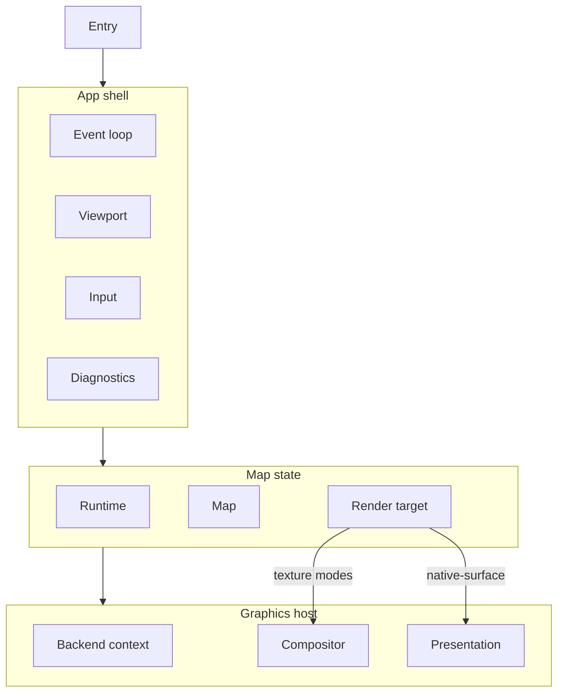
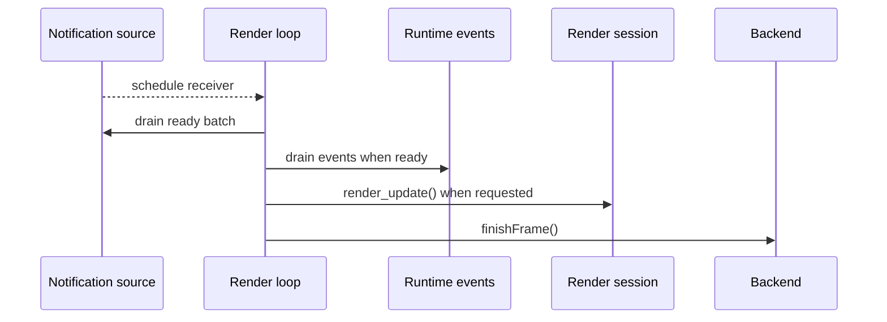
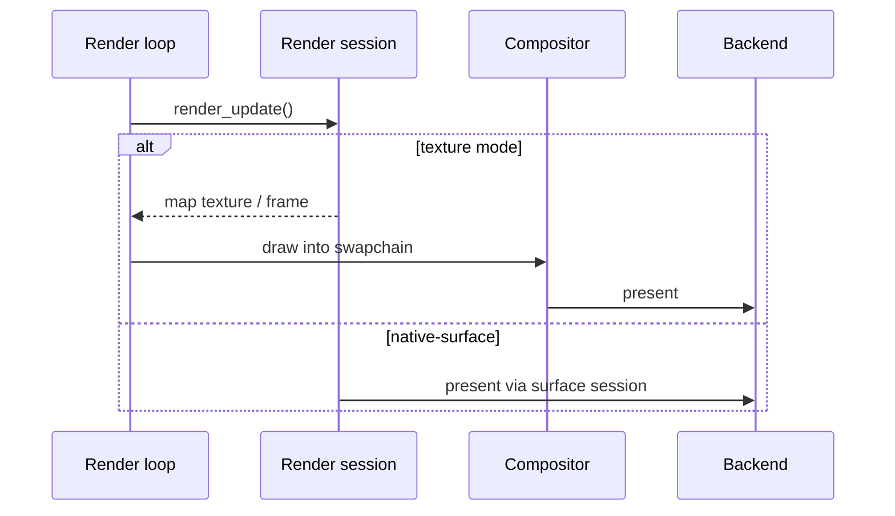

Specification for interactive `*-map` example programs: small apps that exercise
language bindings and render-target integrations through a focused map demo.

The specification has four sections:

1. [Mise tasks](#mise-tasks) — the build and run commands every example exposes.
2. [Shared baseline](#shared-baseline) — map, render-session, frame-loop, and
   graphics contracts common to every profile.
3. [Desktop profile](#desktop-profile) — windowed desktop hosts with CLI entry
   and keyboard/mouse input.
4. [Mobile profile](#mobile-profile) — embedded view hosts with touch input.

Implement a desktop example by reading Shared baseline and Desktop profile.
Implement a mobile example by reading Shared baseline and Mobile profile.

---

## Implementations

| Example                | Profile | Binding    | Toolkit         | Platforms             | Backends              |
| ---------------------- | ------- | ---------- | --------------- | --------------------- | --------------------- |
| `examples/c-map`       | Desktop | C          | SDL3            | Linux, macOS          | Vulkan, Metal, OpenGL |
| `examples/zig-map`     | Desktop | Zig        | SDL3            | Linux, macOS, Windows | Vulkan, Metal, OpenGL |
| `examples/go-map`      | Desktop | Go         | SDL3            | Linux                 | OpenGL                |
| `examples/rust-map`    | Desktop | Rust       | winit           | Linux, macOS, Windows | Vulkan, Metal, OpenGL |
| `examples/lwjgl-map`   | Desktop | Kotlin/JVM | GLFW, LWJGL     | Linux, macOS, Windows | Vulkan, Metal, OpenGL |
| `examples/android-map` | Mobile  | Kotlin     | Android view    | Android               | OpenGL/EGL            |
| `examples/dotnet-map`  | Desktop | C#         | GLFW            | Linux, macOS, Windows | Vulkan, Metal, OpenGL |
| `examples/swift-map`   | Desktop | Swift      | AppKit, SwiftUI | macOS                 | Metal                 |
| `examples/swift-map`   | Mobile  | Swift      | UIKit           | iOS                   | Metal                 |

The Compose map example follows the broad strokes of this specification, but
uses its own renderer-integration architecture for Skiko texture sharing.

For examples built by native render-backend variant, “Backends” is the union of
supported configured variants. Each native library artifact includes one render
backend. A single run uses one graphics API, selected at build time
(build-variant examples) or at startup from the loaded library (multi-context
examples).

---

## Mise tasks

Every example exposes the same task contract in its `mise.toml`:

- `build [preset]` compiles the example against a native install prefix. The
  preset defaults to `{{vars.host_native_preset}}`, and the task depends on
  `//:build` for that preset. Both come from the root `ffi:preset` task
  template.
- `run [render-target] [--preset <preset>]` builds and launches the example by
  extending the root `ffi:example-run` task template. The render target defaults
  to `owned-texture`, so `mise run //examples/zig-map:run` works with no
  arguments, and a mode name overrides it, as in
  `mise run //examples/zig-map:run borrowed-texture`.

An example that has not yet implemented every backend rejects an unsupported
preset with an error that names what it supports: `go-map` drives OpenGL
directly and accepts only `*-egl` presets.

The render-target argument is how a caller reaches the modes in
[Render-target selection](#render-target-selection); the program's own CLI
contract is unchanged.

---

## Shared baseline

### Scope

#### What every example provides

- All map, runtime, and render access from application code through the
  project’s language binding for that language.
- Continuous map mode: receiver-scoped notification draining and repaint driven
  by map render events and user input.
- Initial style URL and camera per [Shared defaults](#shared-defaults).
- Camera controls per the active profile ([Desktop profile → Input](#input) or
  [Mobile profile → Input](#input-1)).
- Every graphics API the host toolkit and target platform can support across
  configured variants (Vulkan, Metal, OpenGL/EGL as applicable).
- Render-target coverage per the active profile
  ([Render-target coverage](#render-target-coverage)).
- Startup logging that identifies the active render-target mode and which native
  render backends the loaded library supports.

#### What an example is not

A `*-map` program is a focused map demo. It MUST NOT include automated tests or
packaging/installer UX.

### Shared defaults

#### Style

- Style URL: `https://tiles.openfreemap.org/styles/bright`
- Load the style during map initialization, before the first render.

#### Initial camera

| Field   | Value                                                     |
| ------- | --------------------------------------------------------- |
| Center  | latitude `37.7749`, longitude `-122.4194` (San Francisco) |
| Zoom    | `13.0`                                                    |
| Bearing | `12.0` degrees                                            |
| Pitch   | `30.0` degrees                                            |

Apply with an immediate `jump_to` on startup.

#### Map and runtime

- Runtime cache path: `:memory:` (in-memory).
- Map mode: continuous (`MLN_MAP_MODE_CONTINUOUS`).

### Architecture

#### Overview

Every `*-map` example splits host responsibilities into the same logical
modules. Names differ by language; boundaries MUST NOT be collapsed into a
single monolithic type.



#### Logical modules

| Module           | Responsibility                                                                                                          |
| ---------------- | ----------------------------------------------------------------------------------------------------------------------- |
| App shell        | Profile entry, toolkit lifecycle, main event loop, shutdown ordering.                                                   |
| Viewport         | Map logical size, physical drawable size, and `scale_factor` for `RenderTargetExtent`.                                  |
| Map state        | Owns runtime, map, and active render target; loads style and initial camera.                                            |
| Graphics context | Creates/configures the host presentation surface and owns host graphics API context and presentation resources.         |
| Render target    | Owns the render session and mode-specific resources such as compositors, borrowed textures/images, and acquired frames. |
| Compositor       | Host pass that draws a map-owned or borrowed texture into the swapchain.                                                |
| Input            | Pointer and/or touch → map camera APIs; profile-specific control help.                                                  |
| Diagnostics      | Optional log callback and consistent error messages on failed setup or camera commands.                                 |

Implementations SHOULD mirror this layout in the source tree (separate files or
packages per module).

#### Threads and loops

Examples have one host **render loop** and one native scheduler thread owned by
the runtime.

- The render loop thread owns the host window and input events, the viewport,
  the graphics API context and presentation resources, the compositor, and the
  render session for the session's whole lifetime. It attaches the session,
  renders through it, resizes it, and closes it.
- The runtime owns its scheduler thread. Runtime creation starts it, runtime
  close joins it, and no host code pumps or owns it.
- Runtime, map, camera, projection, and style calls copy their input and may be
  submitted from any host thread. Commands return IDs. Operations return handles
  that the host waits on or resumes from.
- The notification callback may run on any native thread. It MUST only schedule
  a later notification drain on the host receiver; it MUST NOT call the C API.
- The render loop thread MUST be the thread on which the host toolkit delivers
  window, input, and display-refresh callbacks.
- Cross-thread state MUST be limited to receiver scheduling, a render request, a
  shutdown signal, and a first-failure record. Use the host language's atomic or
  synchronized mechanism for each.

The native scheduler isolates style parsing, network completion, map mutation,
and other runtime work from the display-paced loop. The host receives readiness
through one receiver-scoped notification source rather than through polling.

##### Render loop thread by host toolkit

Where the host toolkit fixes which thread receives display-refresh and window
callbacks, that thread is the render loop thread. Where a graphics API context
is thread-current, such as OpenGL through EGL or WGL, the render loop thread is
the only thread that makes it current.

| Example       | Render loop thread                                 |
| ------------- | -------------------------------------------------- |
| `c-map`       | process main thread (SDL window, graphics context) |
| `zig-map`     | process main thread (SDL window, graphics context) |
| `go-map`      | process main thread (SDL window, graphics context) |
| `rust-map`    | winit event-loop thread                            |
| `lwjgl-map`   | GLFW main thread                                   |
| `dotnet-map`  | GLFW main thread                                   |
| `swift-map`   | main run loop (`CADisplayLink`, AppKit/UIKit)      |
| `android-map` | UI thread (`Choreographer`)                        |
| `compose-map` | native surface bridge's producer thread            |

##### Attaching the render session

A render session's owner thread is the thread that attached it, and it does not
change for the session's lifetime. The render loop thread MUST therefore be the
thread that attaches the session, and the same thread MUST close it.

Attach requires only a live map. Startup waits for the map-creation operation,
takes the map handle, and attaches on the render loop thread. Shutdown closes
the session before starting map close. A map close preflight reports invalid
state and leaves the map open while a session is attached.

Attach creates the session's graphics resources on the calling thread, so for
graphics APIs whose context is thread-current the host context MUST be current
on the render loop thread when it attaches. That thread is the only one that
makes it current, and it need never give it up.

The requirement is specific to WGL: the session resolves
`wglCreateContextAttribsARB` through the calling thread's current context, and
without one it falls back to a legacy context that cannot share with a context
current on another thread. Attaching where the host context is already current
avoids both failure modes. Vulkan and Metal have no thread-current context and
are unaffected.

Reattaching, which a graphics context change requires, is entirely local to the
render loop thread: close the session, rebuild the mode-specific resources,
attach again.

#### Graphics API and mode matrix

The example architecture MUST model the active graphics API separately from the
active render-target mode. Graphics context code owns API-level resources
(Vulkan, Metal, OpenGL/EGL/WGL as applicable). Render target code owns the
attached `RenderSessionHandle`, mode-specific resources, resize behavior,
`render_update`, and close behavior.

The loaded native library reports one render backend per library artifact
through `mln_supported_render_backend_mask()`. Examples built across native
render-backend variants expose the union of those backends in the
[Implementations](#implementations) table.

Graphics API selection follows one of these patterns:

- **Build-variant examples** compile only the graphics API implementation that
  matches the active native build variant (for example `zig-map`, `rust-map`,
  `swift-map`).
- **Multi-context examples** ship a graphics context per targeted API and select
  the active API at startup from `supportedRenderBackends()` (for example
  `lwjgl-map`, `dotnet-map`).

OpenGL examples that can run with multiple context providers select EGL or WGL
from `supportedOpenGLContextProviders()`.

Each process run uses one graphics API. Render-target mode selection follows the
active profile ([Entry](#entry) or [Entry and shell](#entry-and-shell)).

Adding a graphics API or render-target mode MUST require localized changes. Keep
each graphics API and render-target mode in its own variant, class, or submodule
rather than branching ad hoc through shared draw code.

### Lifecycle

#### Startup

Order MUST be:

1. Parse profile entry configuration and validate the selected render mode.
2. Read and log the loaded library's supported native render backends from
   `mln_supported_render_backend_mask()`, then validate that the loaded native
   library supports the graphics API selected for this run; fail fast with a
   readable message if not.
3. Create the host presentation surface and initialize the graphics backend for
   the selected graphics API, on the render loop thread.
4. Create a notification source and install the callback that schedules drains
   on the render loop receiver.
5. Start runtime creation with the `:memory:` cache, await the operation, and
   take the runtime handle.
6. Start map creation with the initial viewport and continuous mode, await the
   operation, and take the map handle.
7. Select the event types the example reads.
8. Submit the style and initial atomic-camera commands.
9. Attach the render target for the selected mode on the render loop thread,
   using descriptors produced by the graphics context there.
10. Emit startup information:
    - active render-target mode identifier
    - active render-target status line

On failure after partial setup, close already-created handles in reverse order:
render target, map, runtime, notification source, then graphics. Close the
render target on its owner thread. Await each accepted lifecycle operation and
release its operation handle after inspecting the result.

#### Shutdown

On host termination or fatal error, close resources in order:

1. Leave the render loop and finish or wait on in-flight GPU work if the backend
   requires it, on the render loop thread.
2. Close the render target and its compositor or borrowed texture/image,
   according to graphics API lifetime rules, on the render loop thread.
3. Start and await map close.
4. Start and await runtime close.
5. Close the notification source.
6. Destroy the graphics context and host presentation surface on the render loop
   thread.

Map and runtime close preflight rejects a live or pending child without changing
parent state. The example MUST close the child and retry rather than discard the
parent handle.

#### Handle ownership

- One notification source per render-loop receiver.
- One runtime per process, with one core-owned scheduler thread.
- One map per runtime for the demo.
- One live render target per map at a time.
- One render session owner thread, fixed for the session's lifetime: the thread
  that attached it, which is the render loop thread.
- Map configuration uses commands and operations on the map handle;
  render-target extent and present use the render target.

### Frame loop

The native scheduler continuously advances runtime and map work. The
display-paced render loop reacts to receiver-scoped notifications and draws only
when the render request is set.

#### Render loop iteration

1. Handle window, input, and resize events. Submit camera and map-resize
   commands directly; set the render request for input and completed target
   changes.
2. When notification readiness was scheduled, drain owned ready batches. Drain
   the runtime event queue while its endpoint remains ready, and set the render
   request for matching render events.
3. Apply pending viewport changes to graphics resources and the render target.
4. Consume the render request; when it was set, call `render_update`.
5. Run `finishFrame()`.



`finishFrame()` runs every iteration: swapchain or surface upkeep, resize
handling, and present hooks as required by the host graphics API.

#### Cadence

While the map is visible and the example is active:

- The render loop MUST subscribe to the host toolkit's display-refresh or
  invalidation mechanism.
- The notification callback MUST schedule the receiver immediately when an
  endpoint becomes ready.
- Input and resize callbacks MAY submit commands directly from their host
  thread.
- The native scheduler continues independently while display callbacks pause.
  Readiness remains level-triggered until the receiver drains it.

#### Render requests

The render request can be set by input, resize, or a scheduled runtime-event
drain while the render loop consumes it. It MUST therefore use the host
language's atomic or synchronized mechanism.



Requirements:

- A runtime-event drain MUST set the render request when
  `map_render_update_available` targets this map, or when
  `map_render_frame_finished` targets this map and `needs_repaint` is true.
- The render loop MUST set the render request when input changes the camera and
  when a resize or reattach completes.
- The render loop MUST call `render_update` only when it consumed a set request.
- The render loop MUST consume the request before calling `render_update`, and
  MUST set it again when `render_update` reports any result other than a
  rendered frame. Consuming afterwards could discard a request published during
  the call.
- `map_render_frame_finished` arrives asynchronously through the runtime event
  queue. The render loop MUST NOT wait for it.
- After resize, `render_update` may report a pending size until the resize
  command commits and the map publishes matching state. Keep the render request
  set and retry rather than treating this as a failure.
- A compositor that cannot present the frame it was handed MUST report that as
  no frame rendered, and the render loop MUST set the render request again. A
  minimized or occluded window produces this, and so does a swapchain awaiting
  its rebuild. The map retains the update, so the retry draws it.

Texture modes: after `render_update` reports a rendered frame, MUST run the
compositor pass to copy the map texture into the host swapchain before present.

### Viewport

The viewport value MUST contain:

| Field                               | Meaning                                                                   |
| ----------------------------------- | ------------------------------------------------------------------------- |
| `logical_width`, `logical_height`   | Map coordinate extent passed to `MapOptions` / `RenderTargetExtent`.      |
| `physical_width`, `physical_height` | Drawable pixels of the host framebuffer.                                  |
| `scale_factor`                      | Ratio between physical and logical sizes (content scale / pixel density). |

Derivation rules:

- Read logical and physical sizes from the host toolkit after surface creation
  and on every resize or backing-scale change.
- Compute logical dimensions from physical size and scale when the toolkit only
  exposes physical pixels (use `ceil(physical / scale)`, minimum `1`).
- Log viewport changes at informational level with field labels
  `logical=… physical=… scale=…`.

Pass `logical_*` and `scale_factor` to map creation, session attach, and session
`resize`.

### Map state

The map state module owns the runtime, map, and render session handles plus
map-specific setup.

#### Creation

- Create and await the runtime operation with a `:memory:` cache.
- Create and await the map operation with the current viewport extent and
  continuous mode.
- Select every event type the example reads before it loads the style. A map
  queues an event only while its subscription selects that type.
- Submit the [style URL](#style) command.
- Submit the [initial camera](#initial-camera) command.
- Attach a render target by dispatching on active graphics API and selected
  mode.

#### Event drain

- Drain the notification source when its callback schedules the receiver.
- Read every endpoint in each owned ready batch, then release the batch.
- Drain every runtime event while the runtime-events endpoint remains ready.
- Set the render request when either:
  - `map_render_update_available` targets this map, or
  - `map_render_frame_finished` targets this map and `needs_repaint` is true.

#### Resize API

Expose `resize(viewport)` for the active render target, resize API-level
resources when the graphics context requires it, and submit one map resize
command with the same logical extent. Map resize is the sole authority for
logical width, height, and scale factor after creation.

### Render-target modes

Shared baseline defines three render-target modes (discriminant/class, attach
paths, and present behavior). Each example implements only the modes required by
its profile ([Render-target coverage](#render-target-coverage)). Example
architecture MUST model each implemented mode.

#### Mode comparison

| Mode identifier    | C API concept                            | Compositor | Role                                                        |
| ------------------ | ---------------------------------------- | ---------- | ----------------------------------------------------------- |
| `owned-texture`    | Session-owned backend texture            | Required   | Map allocates texture, host samples it.                     |
| `borrowed-texture` | Caller-owned texture borrowed by session | Required   | Host allocates exportable texture; session renders into it. |
| `native-surface`   | Window presentation surface              | None       | Map renders directly to the host presentation target.       |

#### Startup status lines

Startup MUST print the active mode identifier and exactly one line from this
table:

| Mode identifier    | Printed line                                                                                       |
| ------------------ | -------------------------------------------------------------------------------------------------- |
| `owned-texture`    | `render target status: samples MapLibre-owned texture frames into the host swapchain`              |
| `borrowed-texture` | `render target status: renders into a host-owned texture, then samples it into the host swapchain` |
| `native-surface`   | `render target status: renders directly to the host window surface`                                |

#### `owned-texture`

- Attach with the C API owned-texture descriptor for the active graphics API.
- Pass the host graphics context handles required by that descriptor (see
  [Graphics API](#graphics-api)).
- On `render_update`, acquire the frame/image from the session, draw via
  compositor, release/close the frame per the C API frame lifetime rules.

#### `borrowed-texture`

- Host creates an exportable texture sized to the viewport (see
  [Graphics API](#graphics-api)).
- Attach with the borrowed-texture descriptor referencing host-owned handles.
- On `render_update`, sample that texture through the same compositor path as
  `owned-texture`.
- On resize, allocate a host texture at the new size and hand it to the live
  session with `set_target`, which the render target does inside its own
  `resize` (see [Resize mechanics](#resize-mechanics)).

#### `native-surface`

- Attach with the C API surface descriptor for host presentation (see
  [Graphics API](#graphics-api)).
- `render_update` presents through the surface render target directly.
- `drawTexture` MUST NOT be called for this mode.
- On resize, call session `resize` and rebuild host presentation. When the host
  toolkit supplies a new surface handle for the same graphics context, call
  `set_target` with it; reattach only when the context itself changed or was
  lost.

### Compositor shaders

For `owned-texture` and `borrowed-texture`, the host-owned compositor that
samples the map texture into the host swapchain MUST use a fullscreen triangle
covering the viewport:

- Vertex shader: three corners with pass-through UVs spanning the visible
  `[0, 1] × [0, 1]` texture range (large-triangle technique).
- Fragment shader: `texture(map_texture, uv)` (straight copy, standard UV
  orientation).

SPIR-V, MSL, or GLSL source MAY differ by backend; the GPU output MUST match
that pass.

### Resize mechanics

- Recompute viewport on host size or scale changes; skip rendering if extent is
  empty.
- `resize(viewport)` is a render-target method, and each mode follows the new
  viewport its own way. `owned-texture` and `native-surface` resize
  graphics-context resources, compositor resources for texture modes, and
  session extent in place. `borrowed-texture` cannot: the host-owned exportable
  texture is fixed to the viewport size, so it allocates one at the new size and
  hands it to the live session with `set_target`. A host calls `resize` for
  every mode and branches on none of them.
- The session stays live either way, and so does its renderer, so the map keeps
  its tiles and atlases across a resize. A scale factor change is the exception
  the C API documents, rebuilding the renderer for the new pixel ratio.
- Pick an ownership strategy for the handover and follow the C API's rules for
  it. An example that keeps the outgoing target until the call returns can roll
  back: a rejected replacement leaves the session on the target it had, so it
  releases the replacement and keeps rendering. An example whose graphics layer
  frees the outgoing target first cannot roll back, and treats a rejected
  handover as a session to close and attach again. Caller-owned textures allow
  either, because no backend reads the outgoing texture.
- A Vulkan surface is the exception, and requires the retaining strategy: its
  outgoing `VkSurfaceKHR` must still be valid when `set_target` is called,
  because the session destroys the swapchain built from it first.
- `MLN_STATUS_NATIVE_ERROR` may mean the replacement was already under way, and
  a caller cannot tell it apart from a failure that came earlier. The session
  may therefore hold either target. Detach or close it before releasing either
  one, and attach again rather than reusing it; stopping before the next frame
  is not enough on its own, because the release still happens while the session
  holds the target. Every other status is reported before the target changes,
  which is what makes rolling back to the outgoing target safe.
- Build the replacement to match what the session attached with, which the C API
  states per backend and per function. `set_target` reports
  `MLN_STATUS_UNSUPPORTED` for a target that differs, leaving the session on the
  one it has.
- Reserve [reattach](#reattach) for a target the live session cannot take: a new
  graphics context or device, a target that `set_target` reports as unsupported,
  or a context that was lost.
- Set the render request after any resize.
- The render loop owns the session, so its in-place resize is a local call.
  Submit the matching map resize command; `render_update` may report a pending
  size until that command commits and publishes matching state.

#### Reattach

Reattaching is for a target the live session cannot take, not for a resize. It
happens entirely on the render loop thread, which owns both the session and the
graphics resources. The sequence MUST be:

1. Close the session, then destroy and recreate the host texture or surface.
2. Attach the render target again against the published map.
3. Set the render request.

Closing the session first matters: the render loop owns both the session and the
graphics resources it borrows, and the session must stop referencing a texture
before that texture is destroyed.

Profile sections define which host events trigger resize
([Desktop profile → Resize triggers](#resize-triggers) or
[Mobile profile → Resize triggers](#resize-triggers-1)).

### Diagnostics

- SHOULD register a native log callback during startup and clear it on shutdown.
- On setup or camera failure, print a short message including the native status
  and diagnostic strings returned by the C API.
- On startup, emit the items listed in [Startup](#startup) step 8 through the
  profile logging sink.

### Graphics API

Attach descriptors and shared context handles for each graphics API the example
binary targets. Implement only the modes required by the active profile
([Render-target coverage](#render-target-coverage)).

#### Vulkan

- One shared Vulkan context (`VkInstance`, `VkDevice`, queue, and
  `VkSurfaceKHR`) for compositor and render session.
- `owned-texture`: Vulkan owned-texture descriptor with those shared handles.
- `borrowed-texture`: exportable `VkImage` and view sized to the viewport;
  borrowed-texture descriptor.
- `native-surface`: surface / swapchain presentation descriptor for the host
  `VkSurfaceKHR`.

A host swapchain in the texture modes MUST:

- Name the outgoing swapchain as `oldSwapchain` when it builds the replacement,
  and destroy the retired one after that call returns. Destroying first leaves
  the surface without images, and the window goes black until the replacement
  presents.
- Hold one present-wait semaphore per swapchain image and wait on the one that
  belongs to the acquired image. A semaphore shared across images lets one
  frame's submit signal it while another frame's present still waits on it,
  which Vulkan forbids and which presents half-drawn frames.
- Rebuild after `VK_SUBOPTIMAL_KHR` from acquire or present, as it rebuilds
  after `VK_ERROR_OUT_OF_DATE_KHR`. A suboptimal swapchain presents frames that
  no longer match the surface, and it stays suboptimal until it is rebuilt.

#### Metal

- `native-surface`: Metal surface descriptor for the host `CAMetalLayer`.
- `owned-texture`: Metal owned-texture descriptor; shared device and layer
  handles required by the C API.
- `borrowed-texture`: exportable Metal texture sized to the viewport;
  borrowed-texture descriptor.

A host compositor MUST treat a `CAMetalLayer` that hands out no drawable as a
frame to retry. A minimized or occluded window has none to give, and the
drawable pool empties under load.

#### OpenGL / EGL / WGL

- `native-surface`: OpenGL/EGL/WGL surface descriptor for the host platform GL
  surface.
- `owned-texture`: OpenGL owned-texture descriptor; shared GL context handles
  required by the C API.
- `borrowed-texture`: exportable GL texture sized to the viewport;
  borrowed-texture descriptor.

### Render-target coverage

| Profile | Required modes on every graphics API build variant the example ships |
| ------- | -------------------------------------------------------------------- |
| Desktop | `owned-texture`, `borrowed-texture`, `native-surface`                |
| Mobile  | `native-surface`                                                     |

---

## Desktop profile

### Scope

Desktop `*-map` examples add:

- One top-level resizable map window.
- CLI render-target mode selection across all three modes.
- Keyboard and mouse camera controls.
- Graceful process exit when the user closes the window.

### Entry

#### Render-target selection

The process MUST accept a render-target mode name:

| Mode                          | CLI value          |
| ----------------------------- | ------------------ |
| Session-owned texture         | `owned-texture`    |
| Caller-owned borrowed texture | `borrowed-texture` |
| Native window surface         | `native-surface`   |

The mode is a required positional argument (for example
`zig-map owned-texture`). There is no default mode.

On `--help`, print usage listing the three mode names and exit `0` before
creating a window. On invalid arguments, print usage listing the three mode
names and exit `1` before creating a window.

#### Other flags

The only permitted flag is `--help`. Implementations MUST NOT add other CLI
flags.

### Shell and window

- Initial logical size: `960` × `640` pixels.
- Window MUST be resizable.
- High-DPI / Retina: derive map `RenderTargetExtent` from the window's drawable
  size and content scale (see [Viewport](#viewport)).
- Shutdown triggers on window close.

### Startup logging

On startup, print the items listed in [Startup](#startup) step 8 to stdout, plus
the control help text from [Input](#input) below.

### Input

#### Control scheme

Implementations MUST provide the following interactions and MUST print this help
text once at startup:

```text
Controls:
  left drag: pan
  right drag or Ctrl+left drag: rotate with X, pitch with Y
  scroll: zoom at cursor
  arrows or WASD: pan
  + / -: zoom at center
  Q / E: rotate
  ] / [: pitch
  0: reset pitch and bearing
```

#### Behavioral constants

| Interaction                   | Behavior                                                                                                                                                                               |
| ----------------------------- | -------------------------------------------------------------------------------------------------------------------------------------------------------------------------------------- |
| Left drag                     | `move_by` with pointer delta in logical coordinates.                                                                                                                                   |
| Right drag, or Ctrl+left drag | Adjust bearing by `0.5 × Δx` degrees; adjust pitch by `0.5 × Δy` degrees (same sign convention everywhere).                                                                            |
| Scroll                        | Zoom about cursor: `scale_by(2^(Δ * 0.25), anchor)`. Δ from the toolkit wheel event; scrolling up zooms in (use OS-adjusted deltas as reported—do not undo platform scroll inversion). |
| Arrow keys / WASD             | Pan `120` logical units per key press.                                                                                                                                                 |
| `+` / `-`                     | Zoom `1.25` / `1/1.25` about viewport center.                                                                                                                                          |
| `Q` / `E`                     | Bearing ±`10`° with keyboard animation.                                                                                                                                                |
| `]`                           | Pitch +`5`° (clamped to `[0, 60]`) with animation.                                                                                                                                     |
| `[`                           | Pitch −`5`° (clamped to `[0, 60]`) with animation.                                                                                                                                     |
| `0`                           | Animate bearing and pitch to `0` with keyboard animation.                                                                                                                              |

Keyboard animated moves SHOULD use ~`160` ms duration. Pointer drags use
immediate `move_by` / `jump_to` / `pitch_by`.

On pointer down that starts a drag, cancel in-flight camera transitions before
applying deltas, and set the map's gesture-in-progress state. Clear that state
when the drag ends, and hold it for the whole drag when a second button goes
down and up during one. Keyboard interactions are discrete commands and leave
the state clear.

Input handlers return whether the camera changed so the render loop can set the
render request.

### Resize triggers

- Subscribe to window size, framebuffer size, and display-scale / content-scale
  events (as available on the platform).

---

## Mobile profile

### Scope

Mobile `*-map` examples add:

- A full-screen or layout-driven map view embedded in the platform app shell.
- Touch camera controls.
- View lifecycle integration (appear, disappear, foreground, background).

### Lifecycle

Mobile examples keep runtime and map state alive across brief disappear and
background transitions. They tear down only on view destruction or app
termination.

Track view visibility and app foreground separately. Run the display-paced
render loop only while the view is visible and the app is in the foreground. The
runtime's native scheduler keeps running across these transitions, so loading
continues while the view is off screen.

When the host toolkit supplies a fresh presentation surface on the graphics
context the session attached with, hand it over with `set_target` on the render
loop thread, which is the thread that attached the session. The session keeps
its renderer, so the map returns warm rather than rebuilding its tiles and
atlases.

Close the render target only when the graphics context itself is gone, on that
same render loop thread. Keep runtime and map handles alive either way, and
attach again on that thread once a context and surface exist, per
[Reattach](#reattach).

| Transition                       | Behavior                                                                                                                                                                                             |
| -------------------------------- | ---------------------------------------------------------------------------------------------------------------------------------------------------------------------------------------------------- |
| View will appear                 | Mark the view visible. If the app is in the foreground, start the render loop, refresh viewport, hand a parked session its surface or attach the render target, and set the render request.          |
| View did disappear               | Mark the view not visible. Stop the render loop. Park the session when the presentation surface goes away and the graphics context survives; close the render target only when that context is gone. |
| App foreground                   | Mark the app foreground. If the view is visible, start the render loop, refresh viewport, hand a parked session its surface or attach the render target, and set the render request.                 |
| App background                   | Mark the app background. Stop the render loop. Park the session when the presentation surface goes away and the graphics context survives; close the render target only when that context is gone.   |
| View destroyed / app termination | Run [Shared shutdown](#shutdown).                                                                                                                                                                    |

### Entry and shell

- The map view fills the available layout area or the screen.
- Derive the initial viewport from the view's layout bounds and content scale
  after the view is on screen.
- Attach `native-surface` for the host `CAMetalLayer`, `VkSurfaceKHR`, or
  platform GL surface supplied by the view.
- Shutdown follows view destruction or app termination.
- Minimal platform bundle files required to run on device or simulator are
  permitted. Store distribution and installer UX remain out of scope.

### Input

Translate platform touch input into distinct one-finger pan, two-finger
scale-rotate, two-finger shove, and double-tap gesture states. Platform gesture
recognizers and custom touch trackers are both valid implementations when they
produce the required camera operations. Scale and rotation share one two-finger
state so a single gesture can zoom and rotate in the same update. Shove is an
exclusive two-finger vertical state selected only when vertical centroid motion
dominates before scale or rotation begins.

#### Control scheme

Implementations MUST provide the following touch interactions:

| Interaction                      | Behavior                                                                                                                                                               |
| -------------------------------- | ---------------------------------------------------------------------------------------------------------------------------------------------------------------------- |
| One-finger drag                  | `move_by` with pointer delta in logical coordinates.                                                                                                                   |
| Pinch                            | Apply incremental scale deltas while preserving the geographic coordinate under the current two-touch centroid, resetting the scale baseline after each applied delta. |
| Two-finger rotate                | Apply incremental bearing deltas from the change in the two-touch vector angle while preserving the geographic coordinate under the current two-touch centroid.        |
| Two-finger vertical drag (shove) | `pitch -= 0.1 × Δy` degrees (clamp to `[0, 60]`), where `Δy` is the change in two-touch centroid Y in logical coordinates since the last applied update.               |
| Double-tap                       | Zoom to `round(zoom₀) + 1.0` about the tap location with animation (~`160` ms).                                                                                        |

On any gesture begin, cancel in-flight camera transitions before applying
deltas, and set the map's gesture-in-progress state. Clear that state when the
gesture ends, including when the platform cancels it. Gestures that run
concurrently share one state, so a gesture ending while another is still live
leaves it set, and the last one to end clears it. Double-tap is a discrete
animated command and leaves the state clear.

Input handlers return whether the camera changed so the render loop can set the
render request.

### Resize triggers

- Subscribe to layout changes, orientation changes, safe-area changes, and
  display-scale / content-scale changes (as available on the platform).

### Logging

- Emit [Startup](#startup) step 8 items and viewport diagnostics through the
  platform log sink (for example `OSLog` on Apple platforms or `logcat` on
  Android).
- Control help is not required on mobile.
