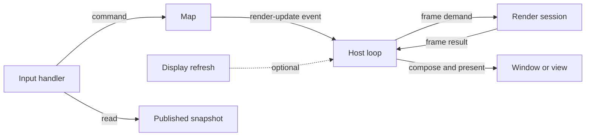

The `*-map` examples are small interactive apps. Each one renders a map through
one language binding and one host toolkit, and uses the library the way an
integrator would. The native core owns execution: the runtime's scheduler thread
runs map work, and a core-worker render session renders on its own graphics
worker. An example submits work, reacts to wakes, and reads published snapshots,
so it carries no executor, frame schedule, or command queue of its own.
[Concepts](/maplibre-native-ffi/concepts/) describes that model.

Every example follows the [shared baseline](#shared-baseline). A desktop example
adds the [desktop profile](#desktop-profile), and a mobile example adds the
[mobile profile](#mobile-profile).

## Implementations

| Example                | Profile | Binding    | Toolkit         | Platforms             | Backends              |
| ---------------------- | ------- | ---------- | --------------- | --------------------- | --------------------- |
| `examples/c-map`       | Desktop | C          | SDL3            | Linux, macOS          | Vulkan, Metal, OpenGL |
| `examples/zig-map`     | Desktop | Zig        | SDL3            | Linux, macOS, Windows | Vulkan, Metal, OpenGL |
| `examples/go-map`      | Desktop | Go         | SDL3            | Linux                 | OpenGL                |
| `examples/rust-map`    | Desktop | Rust       | winit           | Linux, macOS, Windows | Vulkan, Metal, OpenGL |
| `examples/lwjgl-map`   | Desktop | Kotlin/JVM | GLFW, LWJGL     | Linux, macOS, Windows | Vulkan, Metal, OpenGL |
| `examples/dotnet-map`  | Desktop | C#         | GLFW            | Linux, macOS, Windows | Vulkan, Metal, OpenGL |
| `examples/compose-map` | Desktop | Kotlin/JVM | Compose, Skiko  | Linux, macOS, Windows | Vulkan, Metal, OpenGL |
| `examples/swift-map`   | Desktop | Swift      | AppKit, SwiftUI | macOS                 | Metal                 |
| `examples/swift-map`   | Mobile  | Swift      | UIKit           | iOS                   | Metal                 |
| `examples/android-map` | Mobile  | Kotlin     | Android view    | Android               | Vulkan, OpenGL        |

Each native library artifact carries one render backend, and one run uses one
graphics API. A build-variant example (`c-map`, `zig-map`, `rust-map`,
`swift-map`, `android-map`) compiles the graphics code for its build variant's
backend. A multi-context example (`lwjgl-map`, `dotnet-map`, `compose-map`)
carries a graphics context per backend and selects one at startup from the
loaded library's supported render backends. "Backends" lists the union across
build variants.

The Compose example follows this page's defaults, data flow, input, and smoke
contract. It has one render path, a borrowed texture that its bridge shares with
Skiko, so it takes no render-target argument. Inside the bridge's producer
access, it demands a frame and waits for that demand's result. Its Metal and
Vulkan producers use a core worker. Its OpenGL producer services a caller driver
inside the same access.

## Mise tasks

Every example exposes the same tasks in its `mise.toml`:

- `build [preset]` compiles the example against a native install prefix. The
  preset defaults to `{{vars.host_native_preset}}`, and the task depends on
  `//:build` for that preset. Both come from the root `ffi:preset` task
  template.
- `run [render-target] [--preset <preset>]` builds and launches the example by
  extending the root `ffi:example-run` task template. The render target defaults
  to `owned-texture`, so `mise run //examples/zig-map:run` works with no
  arguments, and `mise run //examples/zig-map:run borrowed-texture` selects
  another mode. The program's own command line keeps its required mode argument.
- `smoke [preset]` builds the example and runs it in [smoke mode](#smoke-mode).
  The task SHOULD run every render-target mode that the example supports, and
  MUST run `owned-texture` on desktop. It fails when any run fails, and it needs
  no network. A Linux host with no display server runs the task under a virtual
  X server, as CI does with `xvfb-run`, or through the toolkit's offscreen
  platform where it has one. CI runs the task on every target that can render
  the preset's backend, with a software renderer where the runner has no GPU.

An example that does not yet implement every backend rejects an unsupported
preset with an error that names what it supports: `go-map` accepts only `*-egl`
presets.

## Shared baseline

### Scope

Every example:

- Calls the runtime, map, and render session only through its language's
  binding.
- Renders a continuous map with the [shared defaults](#shared-defaults).
- Provides the active profile's camera input.
- Supports every graphics API that its toolkit and platform can drive, across
  its build variants, in every render-target mode that its profile requires.
- Logs at startup the render backends that the loaded library supports, the
  active render-target mode, and the session's driver.
- Detaches its render session before it exits.

An example is a focused demo. It carries no automated tests and no packaging or
installer UX, and [smoke mode](#smoke-mode) is its only self-check.

### Shared defaults

| Setting        | Value                                                                            |
| -------------- | -------------------------------------------------------------------------------- |
| Style URL      | `https://tiles.openfreemap.org/styles/bright`                                    |
| Initial camera | Latitude `37.7749`, longitude `-122.4194`, zoom `13`, bearing `12`°, pitch `30`° |
| Runtime cache  | `:memory:`                                                                       |
| Map mode       | Continuous                                                                       |
| Subscription   | Render-update-available, plus any other event type that the example reads        |

The example submits the style and the initial camera, as one jump-mode camera
update, right after map creation and before it attaches a render session.

### Data flow


```mermaid
flowchart LR
  input[Input handler] -- command --> map[Map]
  map -- render-update event --> loop[Host loop]
  display[Display refresh] -. optional .-> loop
  loop -- frame demand --> session[Render session]
  session -- frame result --> loop
  loop -- compose and present --> window[Window or view]
  input -- read --> snapshot[Published snapshot]
```

Input becomes a command. A map update or a display refresh becomes a frame
demand. A wake becomes a drain of events or frame results on the host loop. The
UI reads published snapshots for the state it needs.

#### Commands

- Each input handler MUST turn its event into a map command and submit it from
  the handler, without waiting for an earlier command.
- Commands MUST reach native code in input order, so that a gesture's begin,
  updates, and end stay paired. A binding call that submits before it returns
  keeps that order by itself. Where a binding's call can suspend before it
  submits, the example chains each command behind the one before it.
- Camera input SHOULD use relative camera deltas (move, scale, bearing, pitch),
  so that the map applies each one to its current camera and clamps the result
  to its bounds.
- Nothing waits on a command's completion. The completion reports a failure to
  [diagnostics](#diagnostics).

#### Frame demand

The example MUST demand a frame:

- once when attachment completes, for the map updates published before it;
- after each event drain that contains a render-update-available event from its
  map;
- after each rendered result whose repaint flag is set.

Each demand carries a fresh host token and no timeout. It carries the
render-if-needed flag, except for the retries that
[frame results](#frame-results) describe. A native-surface demand also carries
the present flag. The core coalesces demands and reports one result for each, so
the example tracks no frames in flight, except for a core-worker borrowed
texture as [`borrowed-texture`](#borrowed-texture) describes.

An example whose toolkit paces frames from the display, such as a display link
or `Choreographer`, MAY instead demand one render-if-needed frame per refresh
while the map is visible. It then needs neither the render-update subscription
nor the repaint re-arm.

#### Frame results

On a frame wake, the example drains every queued frame result, and keeps the
outcomes distinct:

| Outcome                                     | Response                                                                                                                  |
| ------------------------------------------- | ------------------------------------------------------------------------------------------------------------------------- |
| Rendered                                    | Show the frame as the [mode](#render-target-modes) describes. Demand again when the repaint flag is set.                  |
| Target not ready, or rendered but not shown | Demand again after about one display refresh, without the render-if-needed flag, because the attempt consumed the update. |
| No update, size pending, superseded         | Nothing. The next map update demands again.                                                                               |

"Rendered but not shown" covers a texture frame that the host could not present,
such as when the swapchain is out of date or the layer has no drawable. A demand
without a timeout never reports a missed deadline.

#### Wakes

The runtime options carry the event wake, and the attach options carry the frame
wake and, for a caller driver, the driver-work wake. Each wake runs on a native
thread. It MUST only schedule its drain or service on the host loop and return,
for example by posting a toolkit event, dispatching to the main queue, or
posting to a handler. The scheduled handler drains every queued event or result
in one call.

#### State reads

Input that needs current map state reads the map's published camera snapshot,
such as the zoom that a double tap starts from. The example reads state from
snapshots instead of mirroring it from events or completions.

The example awaits a completion only where later work depends on it, such as map
creation before the first command, attachment before the first demand, a texture
replacement before the outgoing texture is released, and detach before the
session is destroyed. Each wait uses the binding's own idiom, such as a future,
a suspension, or a blocking wait.

### Render sessions

Every session uses the core-worker driver where its render target accepts one.
The [concepts](/maplibre-native-ffi/concepts/#render-session) driver table is
authoritative. For the examples, that table gives:

| Graphics API                   | `owned-texture`        | `borrowed-texture`     | `native-surface`       |
| ------------------------------ | ---------------------- | ---------------------- | ---------------------- |
| Metal                          | core worker            | core worker            | core worker            |
| Vulkan                         | core worker            | core worker            | core worker            |
| OpenGL on a WGL or EGL context | caller graphics thread | caller graphics thread | caller graphics thread |

A browser example uses the caller driver for an existing WebGL context or for
WebGPU, and a core worker for a transferred `OffscreenCanvas`. The example
selects the driver in one place, from the graphics API and the mode.

#### Core-worker sessions

The example attaches, awaits the attach completion, and demands its first frame.
The worker initializes, renders, resizes, and tears down the target on its own
thread, so the host runs nothing for the session. The host's own graphics work,
its compositor and swapchain, stays on the host loop and runs alongside the
worker. Frame acquisition orders the two for an owned texture, demand gating
orders them for a borrowed texture, and a native surface needs no ordering.

A Vulkan core worker submits to the queue that its context descriptor names,
from the worker thread. Vulkan requires a queue's submissions to be externally
synchronized, so in the texture modes, where the host also submits, the example
MUST give the session a second queue from the same graphics family, and the host
never submits to that queue. A device whose graphics family exposes one queue,
as MoltenVK's do, uses the caller driver for the texture modes. A native surface
shares the device's queue, because the host submits nothing in that mode.

#### Caller-graphics-thread sessions

A caller-driver session runs its graphics work inside driver-service calls on
the graphics thread, the thread where the host's context is usable. The service
loop is one handler:

- The driver-work wake posts a service request to the graphics thread's loop.
- The handler services the session with a work limit of zero, which runs every
  queued item.

Nothing else services the session. Attach, resize, target replacement, and
detach all progress through that handler, so the example keeps the loop running
until their completions arrive. Where startup or shutdown blocks the graphics
thread, it alternates driver service with a wait for the next driver-work wake
or for the completion. The example keeps servicing while presentation is paused,
such as when the window is minimized or the app is in the background. If the
graphics thread can no longer service the session, the example abandons it.

### Render-target modes

| Mode identifier    | Render target           | Host compositor |
| ------------------ | ----------------------- | --------------- |
| `owned-texture`    | owned texture target    | Required        |
| `borrowed-texture` | borrowed texture target | Required        |
| `native-surface`   | native surface          | None            |

#### Startup status lines

Startup MUST print the active mode identifier, the driver as
`render driver: core-worker` or `render driver: caller-graphics-thread`, and
exactly one line from this table:

| Mode identifier    | Printed line                                                                                       |
| ------------------ | -------------------------------------------------------------------------------------------------- |
| `owned-texture`    | `render target status: samples MapLibre-owned texture frames into the host swapchain`              |
| `borrowed-texture` | `render target status: renders into a host-owned texture, then samples it into the host swapchain` |
| `native-surface`   | `render target status: renders directly to the host window surface`                                |

#### `owned-texture`

- Request a ring depth of two or three.
- After a rendered result, acquire frames until acquisition reports not ready.
  Keep the newest one, and release the older ones at once with CPU-complete
  sync, because nothing read them.
- Draw the newest frame through the compositor after its producer
  synchronization. The compositor's GPU submission waits on the producer sync,
  and a CPU-complete sync needs no wait.
- Hold the newest frame until a newer one replaces it, so the compositor can
  redraw the window without a new render. Release it before a session resize,
  which the session rejects while the host holds a frame.
- Release each frame with consumer-completion sync that covers the compositor's
  reads, or with CPU-complete sync after those reads finish. A held frame keeps
  its ring slot, and a demand waits for a free slot.

#### `borrowed-texture`

- Allocate a texture at the viewport's physical size that allows rendering and
  sampling, and attach with the borrowed-texture descriptor.
- After a rendered result, draw the texture through the compositor.
- With a core worker, the texture belongs to the session from a demand until its
  result, and to the host from a rendered result until the compositor's reads
  finish. The example keeps at most one demand outstanding. A map update or
  repaint that arrives meanwhile marks a frame as wanted, and the example
  demands it when the compositor's reads finish.
- A caller driver renders and composes on the same thread in order, so it needs
  no gating.

Resize replaces the texture, because a borrowed texture's owner sets its size:

1. Allocate a replacement at the new physical size.
2. Start a target replacement with it, and submit a map resize with the new
   logical extent, because a target replacement leaves the map's extent
   unchanged.
3. Keep drawing the outgoing texture until the replacement completes.
4. Then demand a frame without the render-if-needed flag, and draw the
   replacement from that demand's rendered result or a later one.
5. Release the outgoing texture after the compositor's last read of it.

When the replacement fails, release the replacement and keep the outgoing
texture. After an ambiguous native failure, detach or abandon the session before
releasing either texture.

#### `native-surface`

- Attach with the surface descriptor for the host window or view.
- Set the present flag on every demand. A rendered result means that the session
  presented the frame.
- On resize, start a session resize. When the toolkit supplies a new surface for
  the same graphics context, start a target replacement instead.

#### Compositor

The compositor for `owned-texture` and `borrowed-texture` MUST draw one
fullscreen triangle over the viewport:

- The vertex shader emits three corners with pass-through UVs that span the
  visible `[0, 1] × [0, 1]` texture range.
- The fragment shader samples the map texture at that UV, a straight copy in
  standard UV orientation.

SPIR-V, MSL, and GLSL source differ by backend, and the output matches that
pass.

### Viewport and resize

The viewport value MUST contain:

| Field                               | Meaning                                       |
| ----------------------------------- | --------------------------------------------- |
| `logical_width`, `logical_height`   | The map extent in UI pixels.                  |
| `physical_width`, `physical_height` | The drawable size in device pixels.           |
| `scale_factor`                      | The ratio between physical and logical sizes. |

The example reads the sizes from the toolkit after it creates the window or
view, and again on each size or scale change. When the toolkit exposes only
physical pixels, the logical size is `ceil(physical / scale)`, at least `1`. The
example logs each change with the labels `logical=… physical=… scale=…`.

On a size change at the same scale factor:

- The example ignores a change that leaves the viewport equal.
- `owned-texture` and `native-surface` start one session resize with the new
  logical extent, and resize the host's swapchain and compositor resources. A
  later resize supersedes an earlier one that has not applied, so the example
  needs no resize pacing and never blocks the platform's resize callback.
- `borrowed-texture` replaces its texture as
  [`borrowed-texture`](#borrowed-texture) describes.
- With no session attached, the map resize is the only authority.

A session fixes its scale factor at attachment, so a scale change reattaches.

#### Reattach

The example reattaches on a scale change, on a new graphics context or device,
and on target loss:

1. Stop demand, and release acquired frames.
2. Detach and await the completion, or abandon when detach fails.
3. Destroy the session.
4. Rebuild the host graphics resources.
5. Attach, await the completion, and demand a frame.

The map keeps its style, camera, and feature state across a reattach.

### Lifecycle

#### Startup

1. Parse the entry configuration, and validate the selected mode.
2. Log the loaded library's supported render backends, then select or validate
   the active one.
3. Create the window or view and the host graphics resources.
4. Create the runtime with its event wake.
5. Create the map with the initial extent and the subscription, and await it.
6. Submit the style and the initial camera.
7. Attach the render session with the selected driver and wakes, and await the
   attach completion.
8. Log the mode, its [status line](#startup-status-lines), and the driver.
9. Demand the first frame.

A failure at any step runs [shutdown](#shutdown) for what exists.

#### Shutdown

On window close, view destruction, app termination, or a fatal error:

1. Stop frame demand.
2. Release acquired frames.
3. Detach the session and await the completion. A caller driver keeps servicing
   until it arrives. When detach fails, or the graphics thread can no longer
   service it, abandon the session instead, and log any quarantined resource
   count.
4. Destroy the session.
5. Release mode resources and the host graphics resources.
6. Release the map, then the runtime, and await both release completions.

The process may exit with a live runtime and map, but never with a session that
still makes graphics calls. An exit path that skips the steps above abandons the
session first.

#### Handle ownership

- One runtime and one map per process, and at most one session per map.
- An event batch and a frame-result batch each own their records until release.
- An acquired frame leases one ring slot until its release returns.
- Host graphics handles that a descriptor names stay valid until detach
  completes. Abandon quarantines resources that need graphics access to destroy.

### Graphics APIs

#### Vulkan

- One instance and device serve the compositor and the session. The session gets
  its own queue in the texture modes, as
  [core-worker sessions](#core-worker-sessions) describes.
- While a core worker submits, the host waits on its own queue or fences.
  `vkDeviceWaitIdle` requires every queue of the device to be externally
  synchronized, so the host calls it only after detach completes.
- `owned-texture` and `borrowed-texture` use the owned and borrowed texture
  descriptors. A borrowed `VkImage` allows color-attachment and sampled use.
- `native-surface` uses the surface descriptor for the host's `VkSurfaceKHR`. An
  outgoing `VkSurfaceKHR` stays valid until its replacement completes.

A host swapchain in the texture modes MUST:

- Name the outgoing swapchain as `oldSwapchain` when it builds the replacement,
  and destroy the retired one after that call returns. Destroying it first
  leaves the surface without images, and the window goes black until the
  replacement presents.
- Hold one present-wait semaphore per swapchain image, and wait on the one that
  belongs to the acquired image. A semaphore shared across images lets one
  frame's submit signal it while another frame's present still waits on it,
  which Vulkan forbids and which presents half-drawn frames.
- Rebuild after `VK_SUBOPTIMAL_KHR` from acquire or present, as it rebuilds
  after `VK_ERROR_OUT_OF_DATE_KHR`. A suboptimal swapchain stays suboptimal
  until it is rebuilt.

#### Metal

- `owned-texture` and `borrowed-texture` use the owned and borrowed texture
  descriptors with the host's `MTLDevice`.
- `native-surface` uses the surface descriptor for the host's `CAMetalLayer`.
  The session sets the layer's drawable size, and the host sets its frame and
  contents scale. In the texture modes, the host compositor sizes the drawable
  to the frames it shows.
- A host compositor treats a `CAMetalLayer` that hands out no drawable as a
  frame to retry. A minimized or occluded window has none to give, and the
  drawable pool empties under load.

#### OpenGL

- Each mode uses its descriptor with the host's WGL or EGL context, and the
  caller driver.
- An example that can run with more than one context provider selects EGL or WGL
  from the loaded library's supported OpenGL context providers.

### Source layout

An example keeps these concerns in separate files or packages, named in its
language's style:

| Concern          | Holds                                                         |
| ---------------- | ------------------------------------------------------------- |
| App shell        | Entry, toolkit lifecycle, the host loop, and shutdown order.  |
| Viewport         | Logical size, physical size, and scale factor.                |
| Map state        | The runtime and map, the style, and the initial camera.       |
| Graphics context | The host graphics API objects and the window or view surface. |
| Render target    | The session, its mode resources, demand, and result handling. |
| Compositor       | The host pass that draws a map texture into the swapchain.    |
| Input            | Toolkit input to map commands.                                |
| Diagnostics      | The log callback and failure messages.                        |

Adding a graphics API or a render-target mode changes one variant, class, or
module, rather than branches spread through shared code.

### Diagnostics

- The example SHOULD register a native log callback at startup and clear it at
  shutdown.
- On a setup or command failure, the example prints a short message with the
  native status and diagnostic text.
- The example emits its startup lines through the profile's logging sink.

### Smoke mode

Smoke mode checks that an example renders, with no user, no visible window, and
no network. The `smoke` task in [Mise tasks](#mise-tasks) runs it. A headless
example outside this specification, such as `zig-readback`, uses the same switch
and the same inline style. The iOS example has no smoke mode yet, so the mobile
rules below apply to Android. The Compose example runs its one render path in
place of `owned-texture`.

- A desktop example MUST enter smoke mode when the environment variable
  `MLN_EXAMPLE_SMOKE` is `1`. Any other value, or no value, runs the example
  normally.
- An Android example MUST enter smoke mode when its launch intent carries the
  boolean extra `smoke` set to `true`.
- On desktop, the command line is the same in both modes.
- The example MUST load an inline style that needs no network in place of the
  style URL. A style with one background layer is enough.
- A desktop example renders where no one sees it: a hidden window, a window
  placed off screen, or a layer that no window shows. An Android example renders
  in its normal view.
- After the first frame that the example shows, it MUST print
  `smoke: rendered a frame`, run [shutdown](#shutdown), and exit with status
  `0`. An Android example writes the line to logcat, where the task reads it,
  and then finishes its activity.
- When setup fails, or when no frame renders within 60 seconds, a desktop
  example MUST print a message that names the failure and exit with a nonzero
  status. The Android task bounds its wait from the host.

## Desktop profile

A desktop example adds one resizable map window, a command-line mode selection,
keyboard and mouse camera input, and a clean exit when the user closes the
window.

### Entry

#### Render-target selection

The program MUST take the render-target mode as its one required positional
argument, as in `zig-map owned-texture`. It has no default mode.

| Mode                  | Argument           |
| --------------------- | ------------------ |
| Session-owned texture | `owned-texture`    |
| Caller-owned texture  | `borrowed-texture` |
| Native window surface | `native-surface`   |

On `--help`, the program prints usage that lists the three modes and exits `0`
before it creates a window. On an invalid argument, it prints the same usage and
exits `1` before it creates a window. `--help` is the only flag, and the
environment selects [smoke mode](#smoke-mode).

### Shell and window

- The initial logical size is `960` × `640`.
- The window is resizable.
- The example derives the [viewport](#viewport-and-resize) from the window's
  drawable size and content scale.
- Closing the window runs [shutdown](#shutdown).
- The example listens for window size, framebuffer size, and display-scale
  changes, as the platform provides them.

At startup, the example prints its startup lines and this control help to
stdout:

```text
Controls:
  left drag: pan
  right drag or Ctrl+left drag: rotate with X, pitch with Y
  scroll: zoom at cursor
  arrows or WASD: pan
  + / -: zoom at center
  Q / E: rotate
  ] / [: pitch
  0: reset pitch and bearing
```

### Input

The example MUST provide these interactions:

| Interaction                   | Command                                                                                                                   |
| ----------------------------- | ------------------------------------------------------------------------------------------------------------------------- |
| Left drag                     | Move by the pointer delta in logical coordinates.                                                                         |
| Right drag, or Ctrl+left drag | Bearing by `0.5 × Δx` degrees and pitch by `0.5 × Δy` degrees, with the same sign convention everywhere.                  |
| Scroll                        | Scale by `2^(Δ × 0.25)` about the cursor, with Δ as the toolkit reports it after OS adjustment, so scrolling up zooms in. |
| Arrow keys, WASD              | Move `120` logical units per press.                                                                                       |
| `+`, `-`                      | Scale by `1.25` or `1 / 1.25` about the viewport center.                                                                  |
| `Q`, `E`                      | Bearing by `±10`°, animated.                                                                                              |
| `]`, `[`                      | Pitch by `±5`°, animated. The map's pitch bounds, `0`° to `60`°, clamp the result.                                        |
| `0`                           | Ease bearing and pitch to `0`.                                                                                            |

Keyboard animations SHOULD last about `160` ms. Pointer drags apply their deltas
without animation.

A pointer down that starts a drag cancels camera transitions in flight and
begins the map's gesture. The drag's deltas carry the gesture's update phase,
and the drag's end ends the gesture. A second button that goes down and up
during a drag leaves the gesture running. Keyboard commands are discrete and
carry no gesture phase.

## Mobile profile

A mobile example adds a map view that fills its layout in the platform's app
shell, touch camera input, and view lifecycle integration. Minimal platform
bundle files to run on a device or simulator are in scope, and store
distribution is not.

### Entry and shell

- The example derives the initial viewport from the view's layout bounds and
  content scale once the view is on screen.
- The example attaches `native-surface` to the `CAMetalLayer`, `VkSurfaceKHR`,
  or EGL window surface that the view supplies.
- The example listens for layout, orientation, safe-area, and display-scale
  changes, as the platform provides them.
- The example emits its startup lines and viewport changes through the platform
  log sink, such as `OSLog` or logcat. Control help is not required.

### Lifecycle

The runtime and map stay alive across brief disappear and background
transitions, and the example tears them down only on view destruction or app
termination. The runtime keeps loading while the view is off screen.

The example tracks view visibility and app foreground separately, and demands
frames only while the view is visible and the app is in the foreground. On a
transition to the background, it also awaits a render-session barrier while the
platform keeps the app running, such as inside an iOS background task, so that
no frame renders once the app is suspended. The transition callback itself
returns without waiting.

A platform callback that ends a surface's life, such as Android's
surface-destroyed callback, returns only after the session stops using that
surface. Where the graphics context outlives the surface, the example SHOULD
keep the session warm with a target replacement onto a placeholder surface, such
as an EGL pbuffer, and await it. Otherwise it detaches and awaits the detach. A
caller driver services the session while the callback waits.

When a new surface arrives for the same graphics context, the example replaces
the session's target and keeps the outgoing surface alive until the replacement
completes, so that the map returns warm. When the graphics context itself is
gone, the example detaches, keeps the runtime and map, and attaches again once a
context and a surface exist.

| Transition                     | Behavior                                                                               |
| ------------------------------ | -------------------------------------------------------------------------------------- |
| View will appear               | Mark the view visible. In the foreground, refresh the viewport and resume demand.      |
| View did disappear             | Mark the view hidden, and pause demand.                                                |
| App foreground                 | Mark the app in the foreground. While visible, refresh the viewport and resume demand. |
| App background                 | Mark the app in the background, pause demand, and await a render-session barrier.      |
| Surface created or changed     | Attach, replace the target, or resize, as the viewport and context require.            |
| Surface destroyed              | Replace the target with a placeholder, or detach, before the callback returns.         |
| View destroyed, app terminated | Run [shutdown](#shutdown).                                                             |

### Input

The example translates touch input into distinct one-finger pan, two-finger
scale-rotate, two-finger shove, and double-tap gestures. Platform gesture
recognizers and custom touch trackers both work when they produce these
commands. Scale and rotation share one two-finger gesture, so one update can
zoom and rotate together. Shove is an exclusive two-finger vertical gesture,
selected only when vertical centroid motion dominates before scale or rotation
begins.

The example MUST provide these interactions:

| Interaction              | Command                                                                                                                            |
| ------------------------ | ---------------------------------------------------------------------------------------------------------------------------------- |
| One-finger drag          | Move by the touch delta in logical coordinates.                                                                                    |
| Pinch                    | Scale by the change since the last applied update, about the two-touch centroid.                                                   |
| Two-finger rotate        | Bearing by the change in the two-touch angle since the last applied update, about the two-touch centroid.                          |
| Two-finger vertical drag | Pitch by `-0.1 × Δy` degrees, where Δy is the change in centroid Y since the last applied update. The map's pitch bounds clamp it. |
| Double tap               | Zoom to `round(zoom₀) + 1` about the tap location, animated over about `160` ms, where zoom₀ comes from the camera snapshot.       |

Any gesture's begin cancels camera transitions in flight and begins the map's
gesture. Its updates carry the update phase, and its end or platform
cancellation ends the gesture. Gestures that run at the same time share one map
gesture, which begins with the first and ends with the last. A double tap is a
discrete animated command and carries no gesture phase.
