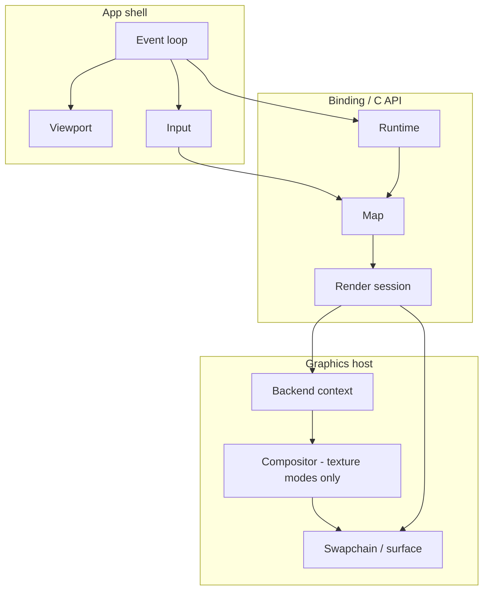
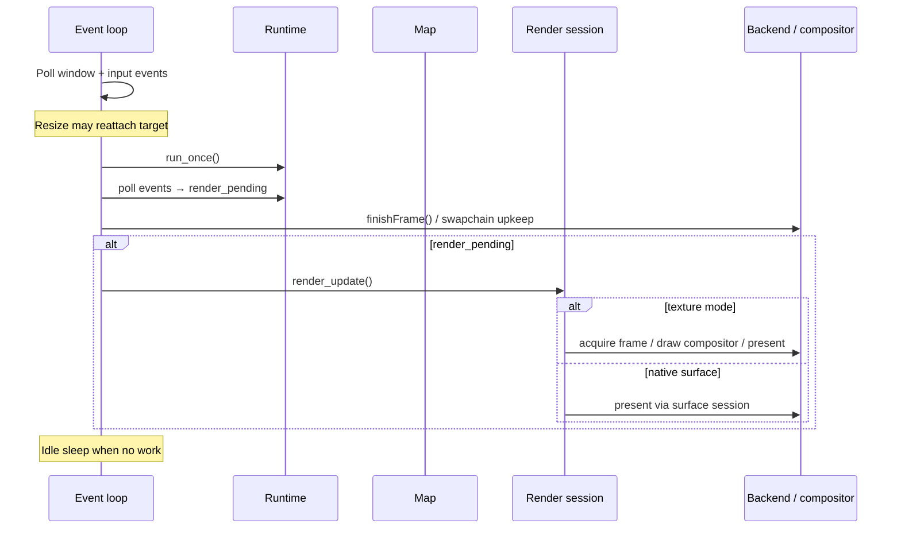

Specification for interactive `*-map` example programs: small apps that exercise
language bindings and render-target integrations through a focused map demo.

## Scope

### What every example provides

- One top-level map window with resize support.
- Continuous map mode: runtime pumping, event draining, and repaint driven by
  map render events and user input.
- Initial style URL and camera per [Shared defaults](#shared-defaults).
- Camera controls per [Input](#input).
- Support for the three render-target modes (see
  [Render-target modes](#render-target-modes)).
- Graceful process exit when the user closes the window.
- Startup logging that identifies the selected render-target mode and which
  native render backends the loaded library supports.

### What an example is not

A `*-map` program is a focused map demo. It MUST NOT include automated tests or
packaging/installer UX.

---

## Implementations

| Example              | Binding  | Toolkit         | Platforms             | Backends              |
| -------------------- | -------- | --------------- | --------------------- | --------------------- |
| `examples/zig-map`   | Zig      | SDL3            | Linux, macOS, Windows | Vulkan, Metal, OpenGL |
| `examples/rust-map`  | Rust     | winit           | Linux, macOS, Windows | Vulkan                |
| `examples/lwjgl-map` | Java FFM | GLFW, LWJGL     | Linux, macOS, Windows | Vulkan                |
| `examples/swift-map` | Swift    | AppKit, SwiftUI | macOS                 | Metal                 |

---

## Shared defaults

### Style

- Style URL: `https://tiles.openfreemap.org/styles/bright`
- Load the style during map initialization, before the first render.

### Initial camera

| Field   | Value                                                     |
| ------- | --------------------------------------------------------- |
| Center  | latitude `37.7749`, longitude `-122.4194` (San Francisco) |
| Zoom    | `13.0`                                                    |
| Bearing | `12.0` degrees                                            |
| Pitch   | `30.0` degrees                                            |

Apply with an immediate `jump_to` on startup.

### Window

- Initial logical size: `960` × `640` pixels.
- Window MUST be resizable.
- High-DPI / Retina: derive map `RenderTargetExtent` from the window’s drawable
  size and content scale (see [Viewport](#viewport)).

### Runtime resources

- Runtime cache path: `:memory:` (in-memory cache only).

### Map mode

- Map mode: continuous (`MLN_MAP_MODE_CONTINUOUS` / binding equivalent).

### Compositor shaders (texture modes)

For `owned-texture` and `borrowed-texture`, the host-owned compositor that
samples the map texture into the window swapchain MUST use equivalent fullscreen
pass shaders:

- Vertex: fullscreen triangle/quad pass-through (`fullscreen.vert` family).
- Fragment: `texture(map_texture, uv)` with standard UV orientation
  (`sample.frag` family).

SPIR-V, MSL, or GLSL source MAY differ by backend; output MUST be a straight
texture copy.

---

## Command-line interface

### Render-target selection

The process MUST accept a render-target mode name:

| Mode                          | CLI value          |
| ----------------------------- | ------------------ |
| Session-owned texture         | `owned-texture`    |
| Caller-owned borrowed texture | `borrowed-texture` |
| Native window surface         | `native-surface`   |

Accepted forms (implementations MUST support all that apply to their language’s
usual argv style):

- Positional: `owned-texture` (bare mode name as a non-flag argument).
- Flag pair: `--render-target <mode>`.
- Flag combined: `--render-target=<mode>`.

If parsing fails or the user requests help, print usage listing the three mode
names and exit before creating a window.

Default mode: `owned-texture`.

Implementations MAY omit support for modes their graphics stack does not provide
(see [Conditional requirements](#conditional-requirements)); omitted modes MUST
be rejected at startup with a clear error if requested on the command line.

### Other flags

- CLI exposes only render-target selection beyond defaults. Implementations MUST
  NOT add flags that change style URL, camera preset, or window size.

---

## Architecture

### Overview

Every `*-map` example splits host responsibilities into the same logical
modules. Names differ by language; boundaries MUST NOT be collapsed into a
single monolithic type.



### Logical modules

| Module                | Responsibility                                                                                                         |
| --------------------- | ---------------------------------------------------------------------------------------------------------------------- |
| App shell             | Process entry, argument parsing, window creation, main event loop, idle pacing, shutdown ordering.                     |
| Viewport              | Map logical size, physical drawable size, and `scale_factor` for `RenderTargetExtent`.                                 |
| Map state             | Owns runtime, map, and render session; loads style and initial camera; attaches render target for the selected mode.   |
| Render-target session | Thin wrapper over `RenderSessionHandle`: resize, `render_update`, close; dispatches by texture vs surface.             |
| Backend               | Graphics API context tied to the window (instance, device, queue, surface/swapchain, or Metal layer / GL context).     |
| Compositor            | Host pass that draws a map-owned or borrowed texture into the swapchain (`owned-texture` and `borrowed-texture` only). |
| Input                 | Pointer and keyboard → map camera APIs; prints control help once at startup.                                           |
| Diagnostics           | Optional log callback and consistent error messages on failed setup or camera commands.                                |

Implementations SHOULD mirror this layout in the source tree (separate files or
packages per module).

### Backend and mode matrix

The backend module MUST be a discriminated implementation per render-target mode
(union, sealed hierarchy, or equivalent). Adding a mode or backend MUST require
a localized change (new enum variant + module), matching the `zig-map` `render/`
layout.

Each backend variant implements, at minimum:

- `init` / `deinit`
- `resize(viewport)`
- `attachRenderTarget(map, viewport) → session`
- `finishFrame()` (swapchain maintenance where applicable)
- `drawTexture(session, viewport)` for texture modes
- `needsRenderTargetReattachOnResize() → bool` (see [Resize](#resize))

---

## Lifecycle

### Startup

Order MUST be:

1. Parse CLI; exit on help or invalid mode.
2. Validate that the loaded native library supports the graphics backend(s) this
   binary targets; fail fast with a readable message if not.
3. Create the window (initial size [Window](#window)).
4. Initialize the graphics backend for the selected mode.
5. Create runtime (`:memory:` cache).
6. Create map with extent from the initial viewport and continuous mode.
7. Load style and apply initial camera.
8. Attach render session for the selected mode.
9. Print render-target mode (and control help).

On failure after partial setup, release already-created handles in reverse order
(session → map → runtime → graphics).

### Shutdown

On window close or fatal error, close resources in order:

1. Finish or wait on in-flight GPU work if the backend requires it.
2. Render session (compositor first when it owns GPU objects separate from the
   session).
3. Map
4. Runtime
5. Graphics context and window.

Implementations MAY use abrupt process exit only when documented
platform/backend bugs make orderly native teardown unsafe; that behavior MUST be
localized and commented (for example `// map-example.md#shutdown`).

### Handle ownership

- One runtime per process (owner thread drives `run_once` / pump).
- One map per runtime for the demo.
- One live render session per map at a time.
- Map configuration (style, camera) uses the map handle; render-target extent
  and present use the render session.

---

## Frame loop

Each frame iteration MUST follow this logical sequence:



Requirements:

- MUST call runtime `run_once` once per loop iteration while the app is running.
- MUST drain runtime events each iteration and set `render_pending` when a
  `map_render_update_available` event targets this map (and MAY also react to
  `map_render_frame_finished` / `needs_repaint` when the binding exposes it).
- MUST set `render_pending` when input changes the camera.
- MUST call `render_update` only while `render_pending` is true; clear the flag
  after a successful update that does not need an immediate retry.
- SHOULD treat `invalid_state` from `render_update` as “nothing to draw yet” and
  continue.
- SHOULD idle-sleep briefly when an iteration makes no progress (event poll,
  render, or runtime work).

Texture modes: after a successful `render_update`, MUST run the compositor pass
to copy the map texture into the window swapchain before present.

---

## Viewport

The viewport value MUST contain:

| Field                               | Meaning                                                                   |
| ----------------------------------- | ------------------------------------------------------------------------- |
| `logical_width`, `logical_height`   | Map coordinate extent passed to `MapOptions` / `RenderTargetExtent`.      |
| `physical_width`, `physical_height` | Drawable pixels of the window framebuffer.                                |
| `scale_factor`                      | Ratio between physical and logical sizes (content scale / pixel density). |

Derivation rules:

- Read logical and physical sizes from the window toolkit after creation and on
  every resize / backing-scale change.
- Compute logical dimensions from physical size and scale when the toolkit only
  exposes physical pixels (use `ceil(physical / scale)`, minimum `1`).
- Log viewport changes at informational level with field labels
  `logical=… physical=… scale=…`.

Pass `logical_*` and `scale_factor` to map creation, session attach, and session
`resize`.

---

## Map state

The map state module owns the binding handles and map-specific setup.

### Creation

- Create runtime with `:memory:` cache.
- Create map with current viewport extent and continuous mode.
- Load [style URL](#style).
- Apply [initial camera](#initial-camera).
- Delegate render-session attachment to the backend for the CLI-selected mode.

### Event drain

- Drain all pending runtime events each frame.
- When `map_render_update_available` references this map’s id/source, return
  `render_update_available = true` to the frame loop.

### Resize API

Expose `resize(viewport)` that forwards to the render-target session (and
compositor when applicable). When the backend reports
`needsRenderTargetReattachOnResize`, expose
`resizeWithReattachedTarget(viewport, backend)` that destroys the session,
resizes backend-owned textures/surfaces, and re-attaches.

---

## Render-target modes

Three modes MUST be modeled in every example’s architecture. Implementations
implement as many as practical for their platform; unimplemented modes remain in
the CLI and backend matrix as stubs or rejected at startup.

### Mode comparison

| CLI value          | C API concept                                                | Compositor | Typical use in spec                                         |
| ------------------ | ------------------------------------------------------------ | ---------- | ----------------------------------------------------------- |
| `owned-texture`    | Session-owned backend texture (e.g. Vulkan owned texture)    | Required   | Default; map allocates texture, host samples it.            |
| `borrowed-texture` | Caller-owned texture/image borrowed by session               | Required   | Host allocates exportable texture; session renders into it. |
| `native-surface`   | Window surface (Vulkan surface, Metal layer, EGL surface, …) | None       | Map renders directly to the swapchain/surface.              |

### `owned-texture`

- Attach with the binding’s “owned texture” descriptor for the active graphics
  API.
- Pass the host’s shared Vulkan/Metal/GL context handles as required by the C
  API.
- On `render_update`, acquire the frame/image from the session, draw via
  compositor, release/close the frame per binding rules.
- Compositor resizes with the viewport independently of session resize where the
  API requires both.

### `borrowed-texture`

- Host creates an API-appropriate exportable texture (or image + view) sized to
  the viewport.
- Attach with the “borrowed texture” descriptor referencing host-owned handles.
- On `render_update`, sample that texture through the same compositor path as
  `owned-texture`.
- `needsRenderTargetReattachOnResize` MUST return `true`: on resize, destroy the
  render session, recreate host textures, and attach a new session for the new
  extent.

### `native-surface`

- Attach with the binding’s surface descriptor (Vulkan swapchain surface, Metal
  `CAMetalLayer`, platform GL surface, etc.).
- `render_update` presents through the surface session directly.
- `drawTexture` MUST NOT be called for this mode.
- Resize: session `resize` plus backend swapchain rebuild as required. Reattach
  when the toolkit recreates the surface handle.

---

## Resize

- Subscribe to window size, framebuffer size, and display-scale / content-scale
  events (as available on the platform).
- Recompute viewport; skip rendering if extent is empty.
- If `needsRenderTargetReattachOnResize()` → full session reattach path.
- Else → resize backend swapchain/context, resize compositor, call session
  `resize` with new extent.
- Set `render_pending` after any resize.

---

## Input

### Control scheme

Implementations MUST provide the following interactions and MUST print this help
text once at startup (wording MAY vary only for platform-specific key names):

```text
Controls:
  left drag: pan
  right drag or Ctrl+left drag: rotate with X, pitch with Y
  scroll: zoom at cursor
  arrows or WASD: pan
  + / -: zoom at center
  Q / E: rotate
  PageUp / PageDown or [ / ]: pitch
  0: reset pitch and bearing
```

### Behavioral constants

| Interaction                   | Behavior                                                                                                         |
| ----------------------------- | ---------------------------------------------------------------------------------------------------------------- |
| Left drag                     | `move_by` with pointer delta in logical coordinates.                                                             |
| Right drag, or Ctrl+left drag | Adjust bearing by `0.5 × Δx` degrees; adjust pitch by `0.5 × Δy` degrees (same sign convention across examples). |
| Scroll                        | Zoom about cursor: `scale_by(2^(Δ * 0.25), anchor)`; negate axis as needed for toolkit scroll direction.         |
| Arrow keys / WASD             | Pan `120` logical units per key press.                                                                           |
| `+` / `-`                     | Zoom `1.25` / `1/1.25` about viewport center.                                                                    |
| `Q` / `E`                     | Bearing ±`10`° with keyboard animation.                                                                          |
| PageUp / `]`                  | Pitch +`5`° (clamped to `[0, 60]`) with animation.                                                               |
| PageDown / `[`                | Pitch −`5`° with animation.                                                                                      |
| `0`                           | Animate bearing and pitch to `0` (duration ~`220` ms).                                                           |

Keyboard animated moves SHOULD use ~`160` ms duration. Pointer drags use
immediate `move_by` / `jump_to` / `pitch_by`.

On pointer down that starts a drag, cancel in-flight camera transitions before
applying deltas.

Input handlers return whether the camera changed so the frame loop can set
`render_pending`.

---

## Diagnostics

- SHOULD register a native log callback during startup and clear it on shutdown
  where the binding supports it.
- On setup or camera failure, print a short message including the binding error
  or diagnostic (implementation-defined detail level).
- On startup, print which render-target mode is active and a one-line
  description of what it demonstrates (see existing `rust-map` / `lwjgl-map`
  status lines).
- MUST print supported native render backends (`metal`, `vulkan`, `opengl`) from
  `mln_supported_render_backend_mask()`.

---

## Conditional requirements

### When Vulkan presents the window

Applies when: the example uses Vulkan for the window surface and swapchain (for
example `rust-map`, `lwjgl-map`, Vulkan builds of `zig-map`).

- MUST implement render-target modes `owned-texture` and `native-surface`.
- SHOULD implement `borrowed-texture` when the binding and swapchain support
  exportable textures.
- MUST use one shared Vulkan context (instance, device, queue, surface) for
  compositor and render session.
- The compositor MUST use the SPIR-V shader pair described in
  [Compositor shaders](#compositor-shaders-texture-modes).

### When presentation goes through a Metal layer or surface

Applies when: the example attaches a `native-surface` session to a
`CAMetalLayer` or equivalent Metal presentation handle (for example `swift-map`,
Metal builds of `zig-map`).

- MUST implement `native-surface`.
- MAY implement texture modes when the binding exposes Metal owned or borrowed
  texture targets.

### When the host uses OpenGL or EGL

Applies when: the example uses OpenGL or EGL for window presentation (for
example OpenGL builds of `zig-map`).

- SHOULD implement all three render-target modes where the binding and GL/EGL
  stack allow owned and borrowed texture paths.
- The compositor MUST still be a fullscreen textured quad equivalent to
  [Compositor shaders](#compositor-shaders-texture-modes).

### When the binding confines map work to a single UI thread

Applies when: the binding or platform requires runtime, map, and render session
use on one UI owner thread (for example AppKit with main-thread isolation).

- All map and render calls MUST run on that thread.
- Window and layer setup MUST stay consistent with the binding’s thread rules
  documented for that integration.

### When the window toolkit has no single cross-platform event pump

Applies when: the host UI framework does not deliver input, resize, and idle
ticks through one portable poll loop (unlike SDL or winit).

- The example MUST still run the [frame loop](#frame-loop) logic each tick
  (runtime pump, event drain, conditional render).
- The example SHOULD drive ticks at roughly display refresh (for example ~60 Hz
  timer or display link).
- [Input](#input) behavior and constants are unchanged; only the event source
  differs.
