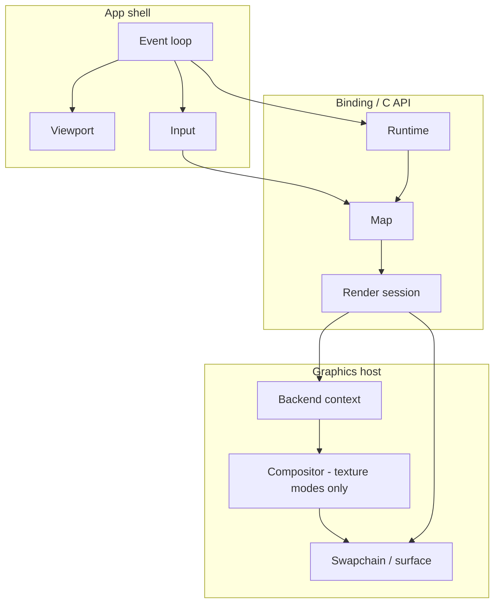
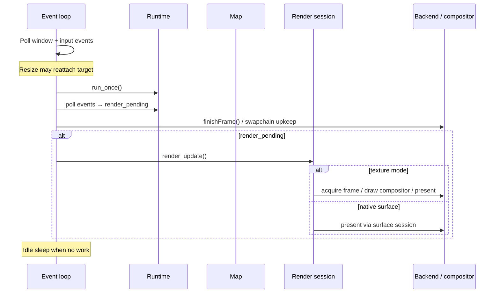

# Map example specification

Normative specification for interactive desktop map example applications
(`*-map`). Each implementation is a small, focused program that exercises the
project's language bindings and render-target integrations through a shared
windowed map demo. It is not a product-ready map SDK, application shell, or
automated test harness.

## Scope {#map-ex-scope}

### In scope {#map-ex-scope-in}

- One top-level map window with resize support.
- Continuous map mode: runtime pumping, event draining, and repaint driven by
  map render events and user input.
- Shared initial map content (style URL and camera).
- Shared camera interaction model (pointer, scroll, keyboard).
- Modular support for three **render-target modes** (see
  [Render-target modes](#map-ex-render-target-modes)), implemented so additional
  graphics backends and modes can be added without rewriting unrelated modules.
- Graceful process exit when the user closes the window.
- Startup logging that identifies the selected render-target mode and, when
  practical, which native render backends the loaded library exposes.

### Out of scope {#map-ex-scope-out}

- Automated tests inside example apps (no unit, integration, or snapshot tests).
- Packaging, installer UX, persistence, search, geolocation, or attribution UI.
- Offline maps, custom style editors, or multi-map layouts.
- CI/task-runner configuration (`mise`, Gradle, Cargo, etc.) — repository
  workflow, not example architecture.
- Mobile-first lifecycle, backgrounding, or power management beyond what the
  desktop window toolkit requires.

---

## Implementations {#map-ex-implementations}

Reference implementations in this repository (not exhaustive of future
examples):

| Example              | Language / toolkit       | Notes                                                                                                    |
| -------------------- | ------------------------ | -------------------------------------------------------------------------------------------------------- |
| `examples/zig-map`   | Zig, SDL3                | Reference architecture; all three render-target modes on supported backends (Vulkan, Metal, OpenGL/EGL). |
| `examples/rust-map`  | Rust, winit              | Vulkan; `owned-texture` and `native-surface` today.                                                      |
| `examples/lwjgl-map` | Java (FFM), GLFW + LWJGL | Vulkan; `owned-texture` and `native-surface` today.                                                      |
| `examples/swift-map` | Swift, AppKit + SwiftUI  | Apple platforms; `native-surface` (Metal) only today.                                                    |

New `*-map` examples MUST follow this spec and add a
`// map-ex: implementations` pointer in the app entry module listing the example
name.

---

## Shared defaults {#map-ex-shared-defaults}

These values MUST match across all `*-map` examples so behavior and visuals are
comparable when switching languages.

### Style {#map-ex-shared-defaults-style}

- **Style URL:** `https://tiles.openfreemap.org/styles/bright`
- Load the style during map initialization, before the first render.

### Initial camera {#map-ex-shared-defaults-camera}

| Field   | Value                                                     |
| ------- | --------------------------------------------------------- |
| Center  | latitude `37.7749`, longitude `-122.4194` (San Francisco) |
| Zoom    | `13.0`                                                    |
| Bearing | `12.0` degrees                                            |
| Pitch   | `30.0` degrees                                            |

Apply with an immediate camera jump (no arrival animation on startup).

### Window {#map-ex-shared-defaults-window}

- **Initial logical size:** `960` × `640` pixels.
- Window MUST be resizable.
- High-DPI / Retina: derive map `RenderTargetExtent` from the window’s drawable
  size and content scale (see [Viewport](#map-ex-viewport)).

### Runtime resources {#map-ex-shared-defaults-runtime}

- **Runtime cache path:** `:memory:` (in-memory cache only).

### Map mode {#map-ex-shared-defaults-map-mode}

- **Map mode:** continuous (`MLN_MAP_MODE_CONTINUOUS` / binding equivalent).

### Compositor shaders (texture modes) {#map-ex-shared-defaults-shaders}

For `owned-texture` and `borrowed-texture`, the host-owned compositor that
samples the map texture into the window swapchain MUST use equivalent fullscreen
pass shaders:

- Vertex: fullscreen triangle/quad pass-through (`fullscreen.vert` family).
- Fragment: `texture(map_texture, uv)` with standard UV orientation
  (`sample.frag` family).

SPIR-V, MSL, or GLSL source MAY differ by backend; output MUST be a straight
texture copy without color grading or UI overlay.

---

## Command-line interface {#map-ex-cli}

### Render-target selection {#map-ex-cli-render-target}

The process MUST accept a render-target mode name:

| Mode                          | CLI value          |
| ----------------------------- | ------------------ |
| Session-owned texture         | `owned-texture`    |
| Caller-owned borrowed texture | `borrowed-texture` |
| Native window surface         | `native-surface`   |

Accepted forms (implementations MUST support all that apply to their language’s
usual argv style):

- Positional: `owned-texture` (bare mode name as a non-flag argument).
- Flag pair: `--render-target <mode>`.
- Flag combined: `--render-target=<mode>`.

If parsing fails or the user requests help, print usage listing the three mode
names and exit without creating a window.

**Default mode:** `owned-texture`.

Implementations MAY omit support for modes their graphics stack does not provide
(see [Conditional requirements](#map-ex-conditional-requirements)); omitted
modes MUST be rejected at startup with a clear error if requested on the command
line.

### Other flags {#map-ex-cli-other}

- No other behavioral flags are required. Implementations MUST NOT add divergent
  style URLs, camera presets, or window sizes via CLI.

---

## Architecture {#map-ex-architecture}

### Overview {#map-ex-architecture-overview}

Every `*-map` example splits host responsibilities into the same logical
modules. Names differ by language; boundaries MUST NOT be collapsed into a
single monolithic type.



### Logical modules {#map-ex-architecture-modules}

| Module                    | Responsibility                                                                                                         |
| ------------------------- | ---------------------------------------------------------------------------------------------------------------------- |
| **App shell**             | Process entry, argument parsing, window creation, main event loop, idle pacing, shutdown ordering.                     |
| **Viewport**              | Map logical size, physical drawable size, and `scale_factor` for `RenderTargetExtent`.                                 |
| **Map state**             | Owns runtime, map, and render session; loads style and initial camera; attaches render target for the selected mode.   |
| **Render-target session** | Thin wrapper over `RenderSessionHandle`: resize, `render_update`, close; dispatches by texture vs surface.             |
| **Backend**               | Graphics API context tied to the window (instance, device, queue, surface/swapchain, or Metal layer / GL context).     |
| **Compositor**            | Host pass that draws a map-owned or borrowed texture into the swapchain (`owned-texture` and `borrowed-texture` only). |
| **Input**                 | Pointer and keyboard → map camera APIs; prints control help once at startup.                                           |
| **Diagnostics**           | Optional log callback and consistent error messages on failed setup or camera commands.                                |

Implementations SHOULD mirror this layout in the source tree (separate files or
packages per module).

### Backend and mode matrix {#map-ex-architecture-matrix}

The **backend** module MUST be structured as a discriminated implementation per
render-target mode (union, sealed hierarchy, or equivalent), not as unrelated
copies. Adding a mode or backend MUST require a localized change (new enum
variant + module), matching the `zig-map` `render/` layout.

Each backend variant implements, at minimum:

- `init` / `deinit`
- `resize(viewport)`
- `attachRenderTarget(map, viewport) → session`
- `finishFrame()` (swapchain maintenance where applicable)
- `drawTexture(session, viewport)` for texture modes
- `needsRenderTargetReattachOnResize() → bool` (see [Resize](#map-ex-resize))

---

## Lifecycle {#map-ex-lifecycle}

### Startup {#map-ex-lifecycle-startup}

Order MUST be:

1. Parse CLI; exit on help or invalid mode.
2. Validate that the loaded native library supports the graphics backend(s) this
   binary targets; fail fast with a readable message if not.
3. Create the window (initial size
   [Shared defaults](#map-ex-shared-defaults-window)).
4. Initialize the graphics **backend** for the selected mode.
5. Create **runtime** (`:memory:` cache).
6. Create **map** with extent from the initial **viewport** and continuous mode.
7. Load **style** and apply **initial camera**.
8. **Attach** render session for the selected mode.
9. Print render-target mode (and control help).

On failure after partial setup, release already-created handles in reverse order
(session → map → runtime → graphics).

### Shutdown {#map-ex-lifecycle-shutdown}

On window close or fatal error, close resources in order:

1. Finish or wait on in-flight GPU work if the backend requires it.
2. **Render session** (compositor first when it owns GPU objects separate from
   the session).
3. **Map**
4. **Runtime**
5. Graphics context and window.

Implementations MAY use abrupt process exit only when documented
platform/backend bugs make orderly native teardown unsafe; that behavior MUST be
localized and commented (`map-ex: lifecycle / shutdown`).

### Handle ownership {#map-ex-lifecycle-ownership}

- One **runtime** per process (owner thread drives `run_once` / pump).
- One **map** per runtime for the demo.
- One live **render session** per map at a time.
- Map configuration (style, camera) goes through the **map** handle, not the
  session, except for render-target extent and present.

---

## Frame loop {#map-ex-frame-loop}

Each frame iteration MUST follow this logical sequence:



Requirements:

- **MUST** call runtime `run_once` (or binding equivalent) once per loop
  iteration while the app is running.
- **MUST** drain runtime events each iteration and set `render_pending` when a
  `map_render_update_available` event targets this map (and MAY also react to
  `map_render_frame_finished` / `needs_repaint` when the binding exposes it).
- **MUST** set `render_pending` when input changes the camera.
- **MUST** call `render_update` only while `render_pending` is true; clear the
  flag after a successful update that does not need an immediate retry.
- **SHOULD** treat `invalid_state` from `render_update` as “nothing to draw yet”
  without fatal exit.
- **SHOULD** idle-sleep briefly when an iteration did no work (event poll,
  render, or runtime progress) to avoid spinning CPU.

Texture modes: after a successful `render_update`, **MUST** run the compositor
pass to copy the map texture into the window swapchain before present.

---

## Viewport {#map-ex-viewport}

The **viewport** value MUST contain:

| Field                               | Meaning                                                                   |
| ----------------------------------- | ------------------------------------------------------------------------- |
| `logical_width`, `logical_height`   | Map coordinate extent passed to `MapOptions` / `RenderTargetExtent`.      |
| `physical_width`, `physical_height` | Drawable pixels of the window framebuffer.                                |
| `scale_factor`                      | Ratio between physical and logical sizes (content scale / pixel density). |

Derivation rules:

- Read logical and physical sizes from the window toolkit after creation and on
  every resize / backing-scale change.
- Compute logical dimensions from physical size and scale when the toolkit only
  exposes physical pixels (use `ceil(physical / scale)`, minimum `1`).
- Log viewport changes at informational level with the same field labels
  (`logical=… physical=… scale=…`) so cross-language logs align.

Pass `logical_*` and `scale_factor` to map creation, session attach, and session
`resize`.

---

## Map state {#map-ex-map-state}

The **map state** module owns the binding handles and map-specific setup.

### Creation {#map-ex-map-state-create}

- Create runtime with `:memory:` cache.
- Create map with current viewport extent and continuous mode.
- Load [shared style URL](#map-ex-shared-defaults-style).
- Apply [shared initial camera](#map-ex-shared-defaults-camera).
- Delegate render-session attachment to the **backend** for the CLI-selected
  mode.

### Event drain {#map-ex-map-state-events}

- Drain all pending runtime events each frame.
- When `map_render_update_available` references this map’s id/source, return
  `render_update_available = true` to the frame loop.

### Resize API {#map-ex-map-state-resize}

Expose `resize(viewport)` that forwards to the render-target session (and
compositor when applicable). When the backend reports
`needsRenderTargetReattachOnResize`, expose
`resizeWithReattachedTarget(viewport, backend)` that destroys the session,
resizes backend-owned textures/surfaces, and re-attaches.

---

## Render-target modes {#map-ex-render-target-modes}

Three modes MUST be modeled in every example’s architecture. Implementations
implement as many as practical for their platform; unimplemented modes remain in
the CLI and backend matrix as stubs or rejected at startup.

### Mode comparison {#map-ex-render-target-modes-compare}

| CLI value          | C API concept                                                | Compositor | Typical use in spec                                         |
| ------------------ | ------------------------------------------------------------ | ---------- | ----------------------------------------------------------- |
| `owned-texture`    | Session-owned backend texture (e.g. Vulkan owned texture)    | Required   | Default; map allocates texture, host samples it.            |
| `borrowed-texture` | Caller-owned texture/image borrowed by session               | Required   | Host allocates exportable texture; session renders into it. |
| `native-surface`   | Window surface (Vulkan surface, Metal layer, EGL surface, …) | None       | Map renders directly to the swapchain/surface.              |

### `owned-texture` {#map-ex-render-targets-owned-texture}

- Attach with the binding’s “owned texture” descriptor for the active graphics
  API.
- Pass the host’s shared Vulkan/Metal/GL context handles as required by the C
  API.
- On `render_update`, acquire the frame/image from the session, draw via
  **compositor**, release/close the frame per binding rules.
- **Compositor** resizes with the viewport independently of session resize where
  the API requires both.

### `borrowed-texture` {#map-ex-render-targets-borrowed-texture}

- Host creates an API-appropriate exportable texture (or image + view) sized to
  the viewport.
- Attach with the “borrowed texture” descriptor referencing host-owned handles.
- On `render_update`, sample that texture through the same compositor path as
  `owned-texture`.
- **`needsRenderTargetReattachOnResize` MUST return `true`:** on resize, destroy
  the render session, recreate host textures, and re-attach (do not only call
  session `resize`).

### `native-surface` {#map-ex-render-targets-native-surface}

- Attach with the binding’s surface descriptor (Vulkan swapchain surface, Metal
  `CAMetalLayer`, platform GL surface, etc.).
- `render_update` presents to the window; no compositor module.
- `drawTexture` MUST NOT be called for this mode.
- Resize: session `resize` plus backend swapchain rebuild as required; reattach
  is not required solely because of mode (unless the toolkit recreates the
  surface handle).

---

## Resize {#map-ex-resize}

- Subscribe to window size, framebuffer size, and display-scale / content-scale
  events (as available on the platform).
- Recompute **viewport**; skip rendering if extent is empty.
- If `needsRenderTargetReattachOnResize()` → full session reattach path.
- Else → resize backend swapchain/context, resize compositor, call session
  `resize` with new extent.
- Set `render_pending` after any resize.

---

## Input {#map-ex-input}

### Control scheme {#map-ex-input-controls}

Implementations MUST provide the following interactions and MUST print this help
text once at startup (wording MAY vary only for platform-specific key names):

```text
Controls:
  left drag: pan
  right drag or Ctrl+left drag: rotate with X, pitch with Y
  scroll: zoom at cursor
  arrows or WASD: pan
  + / -: zoom at center
  Q / E: rotate
  PageUp / PageDown or [ / ]: pitch
  0: reset pitch and bearing
```

### Behavioral constants {#map-ex-input-constants}

| Interaction                   | Behavior                                                                                                         |
| ----------------------------- | ---------------------------------------------------------------------------------------------------------------- |
| Left drag                     | `move_by` with pointer delta in logical coordinates.                                                             |
| Right drag, or Ctrl+left drag | Adjust bearing by `0.5 × Δx` degrees; adjust pitch by `0.5 × Δy` degrees (same sign convention across examples). |
| Scroll                        | Zoom about cursor: `scale_by(2^(Δ * 0.25), anchor)`; negate axis as needed for toolkit scroll direction.         |
| Arrow keys / WASD             | Pan `120` logical units per key press.                                                                           |
| `+` / `-`                     | Zoom `1.25` / `1/1.25` about viewport center.                                                                    |
| `Q` / `E`                     | Bearing ±`10`° with keyboard animation.                                                                          |
| PageUp / `]`                  | Pitch +`5`° (clamped to `[0, 60]`) with animation.                                                               |
| PageDown / `[`                | Pitch −`5`° with animation.                                                                                      |
| `0`                           | Animate bearing and pitch to `0` (duration ~`220` ms).                                                           |

Keyboard animated moves SHOULD use ~`160` ms duration. Pointer drags use
immediate `move_by` / `jump_to` / `pitch_by` without animation.

On pointer down that starts a drag, cancel in-flight camera transitions before
applying deltas.

Input handlers return whether the camera changed so the frame loop can set
`render_pending`.

---

## Diagnostics {#map-ex-diagnostics}

- **SHOULD** register a native log callback during startup and clear it on
  shutdown where the binding supports it.
- On setup or camera failure, print a short message including the binding error
  or diagnostic (implementation-defined detail level).
- On startup, print which render-target mode is active and a one-line
  description of what it demonstrates (see existing `rust-map` / `lwjgl-map`
  status lines).
- **SHOULD** print supported native render backends (`metal`, `vulkan`,
  `opengl`) when the binding exposes them.

---

## Conditional requirements {#map-ex-conditional-requirements}

Rules in this section refine the base spec. They apply only when the stated
property holds. Implementations that do not match a given condition ignore its
bullets. Reference implementations are listed in
[Implementations](#map-ex-implementations); they are examples, not names for the
conditions themselves.

### When Vulkan presents the window {#map-ex-when-vulkan}

**Applies when:** the example uses Vulkan for the window surface and swapchain
(for example `rust-map`, `lwjgl-map`, Vulkan builds of `zig-map`).

- **MUST** implement render-target modes `owned-texture` and `native-surface`.
- **SHOULD** implement `borrowed-texture` when the binding and swapchain support
  exportable textures.
- **MUST** use one shared Vulkan context (instance, device, queue, surface) for
  compositor and render session.
- The compositor **MUST** use the SPIR-V shader pair described in
  [Shared defaults](#map-ex-shared-defaults-shaders).

### When presentation goes through a Metal layer or surface {#map-ex-when-metal-surface}

**Applies when:** the example attaches a `native-surface` session to a
`CAMetalLayer` or equivalent Metal presentation handle (for example `swift-map`,
Metal builds of `zig-map`).

- **MUST** implement `native-surface`.
- **MAY** implement texture modes when the binding exposes Metal owned or
  borrowed texture targets.
- Mobile and non-macOS Metal ports are out of scope until added explicitly.

### When the host uses OpenGL or EGL {#map-ex-when-opengl}

**Applies when:** the example uses OpenGL or EGL for window presentation (for
example OpenGL builds of `zig-map`).

- **SHOULD** implement all three render-target modes where the binding and
  GL/EGL stack allow owned and borrowed texture paths.
- The compositor **MUST** still be a fullscreen textured quad equivalent to
  [Shared defaults](#map-ex-shared-defaults-shaders).

### When the binding confines map work to a single UI thread {#map-ex-when-single-ui-thread}

**Applies when:** the binding or platform requires runtime, map, and render
session use on one UI owner thread (for example AppKit with main-thread
isolation).

- All map and render calls **MUST** run on that thread.
- Window and layer setup **MUST** stay consistent with the binding’s thread
  rules documented for that integration.

### When the window toolkit has no single cross-platform event pump {#map-ex-when-no-unified-event-pump}

**Applies when:** the host UI framework does not deliver input, resize, and idle
ticks through one portable poll loop (unlike SDL or winit).

- The example **MUST** still run the [frame loop](#map-ex-frame-loop) logic each
  tick (runtime pump, event drain, conditional render).
- The example **SHOULD** drive ticks at roughly display refresh (for example ~60
  Hz timer or display link).
- [Input](#map-ex-input) behavior and constants are unchanged; only the event
  source differs.
